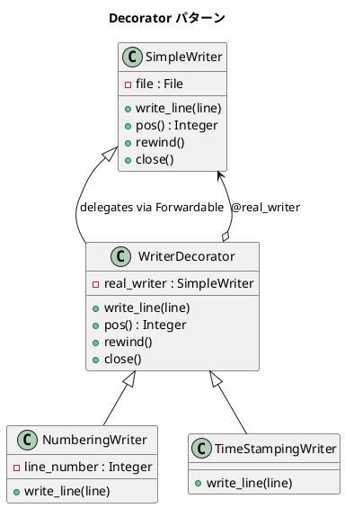

# 第 12 章: Decorator

## はじめに

ファイルにテキストを書き出す機能があるとします。ある場面では行番号を付けたい、別の場面ではタイムスタンプを付けたい、さらに両方を付けたい場面もあります。これらの組み合わせごとにサブクラスを作ると、クラスが爆発的に増えてしまいます。

**Decorator パターン**は、オブジェクトに動的に機能を追加するパターンです。継承ではなく委譲を使い、既存のオブジェクトを「包む」ことで振る舞いを拡張します。

---

## パターンの構造



---

## TDD で作る

### Red: テストを書く

```ruby
class DecoratorTest < Minitest::Test
  def setup
    @path = "/tmp/decorator_test_#{Process.pid}.txt"
  end

  def teardown
    File.delete(@path) if File.exist?(@path)
  end

  def test_simple_writer
    writer = SimpleWriter.new(@path)
    writer.write_line("Hello")
    writer.close
    assert_equal "Hello\n", File.read(@path)
  end

  def test_numbering_writer
    writer = NumberingWriter.new(SimpleWriter.new(@path))
    writer.write_line("Hello")
    writer.write_line("World")
    writer.close
    assert_equal "1: Hello\n2: World\n", File.read(@path)
  end

  def test_stacked_decorators
    writer = TimeStampingWriter.new(
      NumberingWriter.new(
        SimpleWriter.new(@path)
      )
    )
    writer.write_line("Hello")
    writer.close

    content = File.read(@path)
    assert_match(/1: \d{4}-\d{2}-\d{2}.*: Hello/, content)
  end
end
```

`test_stacked_decorators` がこのパターンの真価です。デコレータを入れ子にすることで、行番号とタイムスタンプの両方が付きます。

### Green: 実装する

**SimpleWriter（Component）**:

```ruby
class SimpleWriter
  def initialize(path)
    @file = File.open(path, "w")
  end

  def write_line(line)
    @file.print(line)
    @file.print("\n")
  end

  def pos
    @file.pos
  end

  def rewind
    @file.rewind
  end

  def close
    @file.close
  end
end
```

**WriterDecorator（Decorator 基底クラス）**:

```ruby
class WriterDecorator
  extend Forwardable

  def_delegators :@real_writer, :write_line, :rewind, :pos, :close

  def initialize(real_writer)
    @real_writer = real_writer
  end
end
```

`Forwardable` モジュールの `def_delegators` を使い、変更しないメソッドを自動的に委譲します。手動で 1 つずつ定義するよりも簡潔で、委譲漏れも防げます。

**NumberingWriter / TimeStampingWriter（具象 Decorator）**:

```ruby
class NumberingWriter < WriterDecorator
  def initialize(real_writer)
    super(real_writer)
    @line_number = 1
  end

  def write_line(line)
    @real_writer.write_line("#{@line_number}: #{line}")
    @line_number += 1
  end
end

class TimeStampingWriter < WriterDecorator
  def write_line(line)
    @real_writer.write_line("#{Time.now}: #{line}")
  end
end
```

各 Decorator は `write_line` だけをオーバーライドし、加工した結果を `@real_writer` に委譲します。

---

## Ruby らしい実装

Ruby では Module の `extend` を使い、既存のインスタンスに動的に機能を追加できます。クラスを作る必要すらありません。

```ruby
module NumberingWriterModule
  def write_line(line)
    @line_number ||= 1
    super("#{@line_number}: #{line}")
    @line_number += 1
  end
end

module TimeStampingWriterModule
  def write_line(line)
    super("#{Time.now}: #{line}")
  end
end
```

```ruby
def test_module_based_decorator
  writer = SimpleWriter.new(@path)
  writer.extend(NumberingWriterModule)
  writer.write_line("Hello")
  writer.write_line("World")
  writer.close
  assert_equal "1: Hello\n2: World\n", File.read(@path)
end
```

`extend` はそのインスタンスの特異クラスにモジュールを mix-in するため、他のインスタンスには影響しません。`super` は元の `write_line` を呼び出すので、委譲の仕組みが自然に働きます。

クラスベースとモジュールベースの使い分けは以下の通りです。

- **クラスベース**: デコレータが状態を持つ場合や、同じデコレータを複数箇所で再利用する場合
- **モジュールベース**: 軽量で、特定のインスタンスだけに一時的に機能を追加する場合

---

## まとめ

| 観点 | 内容 |
|------|------|
| **意図** | オブジェクトに動的に機能を追加する。継承のサブクラス爆発を回避する |
| **適用場面** | ログ出力の装飾、I/O ストリームの加工、権限チェックの付加 |
| **Forwardable** | 委譲メソッドを `def_delegators` で簡潔に定義できる |
| **Ruby の強み** | `extend` + Module で実行時にインスタンス単位の Decorator を適用 |
| **関連パターン** | Proxy（アクセス制御）、Adapter（インターフェース変換）、Strategy（アルゴリズム差し替え） |
