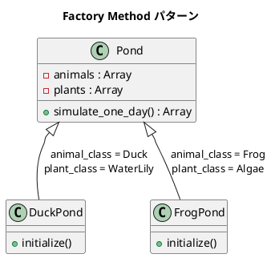
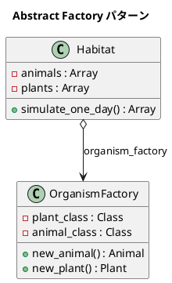

# 第 14 章: Factory

## はじめに

池のシミュレータを考えてみましょう。アヒルの池にはアヒルとスイレン、カエルの池にはカエルと藻が住んでいます。池の種類ごとに「どの動物と植物を生成するか」が異なりますが、シミュレーションのロジック自体は同じです。

**Factory パターン**は、オブジェクトの生成を専門のメソッドやクラスに委ねることで、生成の詳細をクライアントから隠すパターンです。本章では **Factory Method** と **Abstract Factory** の 2 つのバリエーションを扱います。

---

## パターンの構造

### Factory Method



### Abstract Factory



---

## TDD で作る

### Red: テストを書く

まず Factory Method 版のテストを書きます。

```ruby
class DuckPondTest < Minitest::Test
  def test_simulate_one_day
    pond = DuckPond.new(number_animals: 2, number_plants: 1)
    output = pond.simulate_one_day

    assert_includes output, "WaterLily is growing."
    assert_includes output, "Quack!"
    assert_includes output, "Duck is eating."
    assert_includes output, "Duck is sleeping."
  end

  def test_correct_number_of_organisms
    pond = DuckPond.new(number_animals: 3, number_plants: 2)
    output = pond.simulate_one_day

    assert_equal 2, output.count("WaterLily is growing.")
    assert_equal 3, output.count("Quack!")
  end
end
```

次に Abstract Factory 版のテストを書きます。

```ruby
class HabitatWithOrganismFactoryTest < Minitest::Test
  def test_jungle_habitat
    jungle_factory = OrganismFactory.new(Tree, Tiger)
    jungle = Habitat.new(2, 3, jungle_factory)
    output = jungle.simulate_one_day

    assert_equal 3, output.count("Tree is growing.")
    assert_equal 2, output.count("Roar!")
    assert_includes output, "Tiger is eating."
  end

  def test_organism_factory_creates_correct_types
    factory = OrganismFactory.new(Algae, Duck)

    assert_instance_of Duck, factory.new_animal
    assert_instance_of Algae, factory.new_plant
  end
end
```

Abstract Factory 版では、`OrganismFactory` にクラスを渡すだけで任意の組み合わせが作れることがテストで表現されています。

### Green: 実装する

**動物・植物クラス**:

```ruby
class Duck
  def speak = "Quack!"
  def eat   = "Duck is eating."
  def sleep = "Duck is sleeping."
end

class Frog
  def speak = "Croak!"
  def eat   = "Frog is eating."
  def sleep = "Frog is sleeping."
end

class Tiger
  def speak = "Roar!"
  def eat   = "Tiger is eating."
  def sleep = "Tiger is sleeping."
end

class WaterLily
  def grow = "WaterLily is growing."
end

class Algae
  def grow = "Algae is growing."
end

class Tree
  def grow = "Tree is growing."
end
```

**Pond（Factory Method）**:

```ruby
class Pond
  def initialize(number_animals, animal_class, number_plants, plant_class)
    @animals = Array.new(number_animals) { animal_class.new }
    @plants = Array.new(number_plants) { plant_class.new }
  end

  def simulate_one_day
    output = []
    @plants.each { |plant| output << plant.grow }
    @animals.each do |animal|
      output << animal.speak
      output << animal.eat
      output << animal.sleep
    end
    output
  end
end

class DuckPond < Pond
  def initialize(number_animals: 3, number_plants: 2)
    super(number_animals, Duck, number_plants, WaterLily)
  end
end

class FrogPond < Pond
  def initialize(number_animals: 3, number_plants: 2)
    super(number_animals, Frog, number_plants, Algae)
  end
end
```

サブクラスが「何を生成するか」を決定し、親クラスが「どう使うか」を定義する。これが Factory Method の本質です。

**OrganismFactory + Habitat（Abstract Factory）**:

```ruby
class OrganismFactory
  def initialize(plant_class, animal_class)
    @plant_class = plant_class
    @animal_class = animal_class
  end

  def new_animal
    @animal_class.new
  end

  def new_plant
    @plant_class.new
  end
end

class Habitat
  def initialize(number_animals, number_plants, organism_factory)
    @animals = Array.new(number_animals) { organism_factory.new_animal }
    @plants = Array.new(number_plants) { organism_factory.new_plant }
  end

  def simulate_one_day
    output = []
    @plants.each { |plant| output << plant.grow }
    @animals.each do |animal|
      output << animal.speak
      output << animal.eat
      output << animal.sleep
    end
    output
  end
end
```

### Refactor: 設計を改善する

Factory Method（`DuckPond`, `FrogPond`）と Abstract Factory（`OrganismFactory` + `Habitat`）を比較すると、Abstract Factory のほうが柔軟です。新しい組み合わせを作るとき、Factory Method ではサブクラスが必要ですが、Abstract Factory ではファクトリのインスタンスを差し替えるだけで済みます。

---

## Ruby らしい実装

Ruby ではクラスがオブジェクトなので、クラス自体をファクトリとして渡せます。実は上記の実装がすでにこの特徴を活かしています。Java のように Factory インターフェースを定義する必要がありません。

```ruby
# Ruby ではクラスを直接渡せる
jungle_factory = OrganismFactory.new(Tree, Tiger)

# さらにシンプルに: ブロックをファクトリとして使う
class BlockFactory
  def initialize(&block)
    @creator = block
  end

  def create
    @creator.call
  end
end

tiger_factory = BlockFactory.new { Tiger.new }
tiger_factory.create  # => #<Tiger:...>
```

Ruby のファーストクラスオブジェクトとしてのクラスやブロックを活用することで、Factory パターンを軽量に実現できます。

---

## まとめ

| 観点 | 内容 |
|------|------|
| **意図** | オブジェクトの生成をクライアントから分離し、生成のバリエーションを柔軟に管理する |
| **Factory Method** | サブクラスが「何を生成するか」を決定する。組み合わせごとにサブクラスが必要 |
| **Abstract Factory** | 関連するオブジェクト群の生成をファクトリオブジェクトに委譲。継承なしで組み合わせを変更可能 |
| **Ruby の強み** | クラスがオブジェクトであるため、クラスをそのまま引数として渡せる |
| **使い分け** | 固定の組み合わせ → Factory Method、動的な組み合わせ → Abstract Factory |
| **関連パターン** | Builder（複雑なオブジェクトの段階的構築）、Template Method（アルゴリズムの骨格を定義） |
