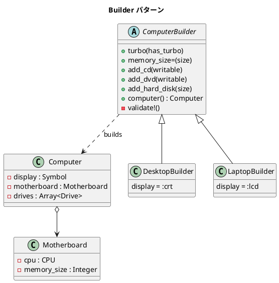

# 第 15 章: Builder

## はじめに

コンピュータを構成するにはディスプレイ、CPU、メモリ、ドライブなど多くの部品が必要です。デスクトップとラップトップでは既定の構成が異なり、組み合わせにはバリデーションも必要です。コンストラクタに大量の引数を渡すのは読みにくく、間違いやすくなります。

**Builder パターン**は、複雑なオブジェクトの構築過程をステップに分解し、同じ構築プロセスで異なる表現を生成できるようにするパターンです。

---

## パターンの構造



---

## TDD で作る

### Red: テストを書く

```ruby
class DesktopBuilderTest < Minitest::Test
  def test_build_desktop_with_turbo_cd_dvd_hard_disk
    builder = DesktopBuilder.new
    builder.turbo
    builder.memory_size = 1024
    builder.add_cd
    builder.add_dvd(true)
    builder.add_hard_disk(500_000)

    computer = builder.computer

    assert_equal :crt, computer.display
    assert_instance_of TurboCPU, computer.motherboard.cpu
    assert_equal 1024, computer.motherboard.memory_size
    assert_equal 3, computer.drives.size
  end

  def test_build_basic_desktop
    builder = DesktopBuilder.new
    builder.add_hard_disk(250_000)

    computer = builder.computer

    assert_instance_of BasicCPU, computer.motherboard.cpu
    assert_equal 512, computer.motherboard.memory_size
  end
end
```

バリデーションもテストで保護します。

```ruby
class BuilderValidationTest < Minitest::Test
  def test_not_enough_memory
    builder = DesktopBuilder.new
    builder.memory_size = 100
    builder.add_hard_disk(250_000)

    error = assert_raises(RuntimeError) { builder.computer }
    assert_match(/Not enough memory/, error.message)
  end

  def test_too_many_drives
    builder = DesktopBuilder.new
    5.times { builder.add_cd }

    error = assert_raises(RuntimeError) { builder.computer }
    assert_match(/Too many drives/, error.message)
  end

  def test_must_have_hard_disk
    builder = DesktopBuilder.new
    builder.add_cd

    error = assert_raises(RuntimeError) { builder.computer }
    assert_match(/Must have at least one hard disk/, error.message)
  end
end
```

これらのテストは、Builder が「不正な構成のコンピュータを作らせない」ことを保証しています。

### Green: 実装する

**部品クラス**:

```ruby
class CPU
  def to_s = "CPU"
end

class BasicCPU < CPU
  def to_s = "BasicCPU"
end

class TurboCPU < CPU
  def to_s = "TurboCPU"
end

class Motherboard
  attr_reader :cpu, :memory_size

  def initialize(cpu, memory_size)
    @cpu = cpu
    @memory_size = memory_size
  end
end

class Drive
  attr_reader :type, :size, :writable

  def initialize(type, size, writable)
    @type = type
    @size = size
    @writable = writable
  end
end

class Computer
  attr_reader :display, :motherboard, :drives

  def initialize(display, motherboard, drives)
    @display = display
    @motherboard = motherboard
    @drives = drives
  end
end
```

**ComputerBuilder（Builder 基底クラス）**:

```ruby
class ComputerBuilder
  attr_reader :computer

  def turbo(has_turbo = true)
    @turbo = has_turbo
  end

  def memory_size=(size)
    @memory_size = size
  end

  def add_cd(writable = false)
    @drives << Drive.new(:cd, 760, writable)
  end

  def add_dvd(writable = false)
    @drives << Drive.new(:dvd, 4700, writable)
  end

  def add_hard_disk(size)
    @drives << Drive.new(:hard_disk, size, true)
  end

  def computer
    validate!
    cpu = @turbo ? TurboCPU.new : BasicCPU.new
    motherboard = Motherboard.new(cpu, @memory_size)
    Computer.new(@display, motherboard, @drives)
  end

  private

  def validate!
    raise "Not enough memory: #{@memory_size}" if @memory_size < 250
    raise "Too many drives: #{@drives.size}" if @drives.size > 4
    raise "Must have at least one hard disk" unless @drives.any? { |d| d.type == :hard_disk }
  end
end
```

`computer` メソッドが呼ばれた時点で `validate!` を実行し、不正な構成を防ぎます。バリデーションを最後に一括で行うことで、構築の順序に依存しない柔軟な API になっています。

**DesktopBuilder / LaptopBuilder（具象 Builder）**:

```ruby
class DesktopBuilder < ComputerBuilder
  def initialize
    @turbo = false
    @memory_size = 512
    @drives = []
    @display = :crt
  end
end

class LaptopBuilder < ComputerBuilder
  def initialize
    @turbo = false
    @memory_size = 512
    @drives = []
    @display = :lcd
  end

  def computer
    raise "Laptop display must be LCD" unless @display == :lcd
    super
  end
end
```

`LaptopBuilder` はディスプレイが LCD であることを追加で検証しています。サブクラス固有の制約を `computer` メソッドのオーバーライドで表現するのがポイントです。

### Refactor: 設計を改善する

各 Builder の `initialize` で既定値を設定し、利用者は変更したい部分だけを指定します。これにより「デスクトップならCRT、ラップトップなら LCD」という知識が Builder の中に閉じ込められ、クライアントコードがシンプルになります。

---

## Ruby らしい実装

Ruby ではブロックやキーワード引数を使って、より自然な DSL 風の構築ができます。

```ruby
# ブロックベースの Builder
class DesktopBuilder
  def self.build
    builder = new
    yield(builder)
    builder.computer
  end
end

# 使い方
computer = DesktopBuilder.build do |b|
  b.turbo
  b.memory_size = 2048
  b.add_hard_disk(500_000)
  b.add_dvd(true)
end
```

`yield` でブロックに Builder を渡すことで、構築手順をブロック内にまとめられます。`build` メソッドが最後に `computer` を呼ぶため、利用者はバリデーション済みの完成品を受け取れます。

---

## まとめ

| 観点 | 内容 |
|------|------|
| **意図** | 複雑なオブジェクトの構築を段階的に行い、同じプロセスで異なる表現を生成する |
| **適用場面** | 多数のパラメータを持つオブジェクト、構成のバリデーションが必要な場合 |
| **バリデーション** | `computer` メソッド呼び出し時に一括検証。構築順序に依存しない |
| **Ruby の強み** | ブロックを使った DSL 風の構築。`yield` で Builder を渡すパターン |
| **Factory との違い** | Factory は「何を作るか」、Builder は「どう作るか」に焦点を当てる |
| **関連パターン** | Factory（生成するオブジェクトの種類を選択）、Composite（構築結果が複合オブジェクト） |
