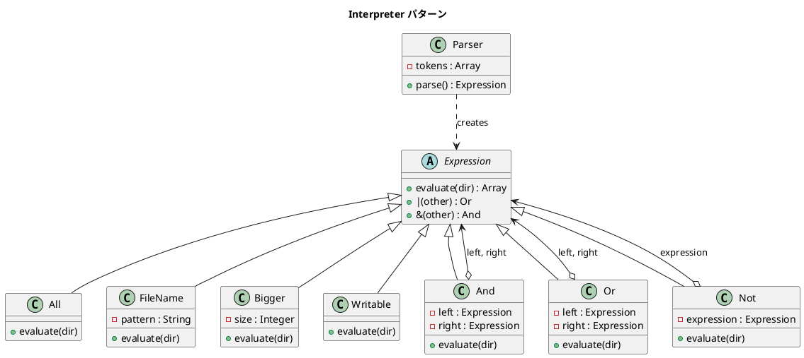

# 第 16 章: Interpreter

## はじめに

ファイル検索の条件を考えてみましょう。「拡張子が `.txt` で、かつサイズが 100 バイト以上」「`.csv` または `.md`」「書き込み可能でないファイル」。これらの条件を組み合わせるには、条件を木構造（AST: Abstract Syntax Tree）として表現し、それを評価する仕組みが必要です。

**Interpreter パターン**は、言語の文法を式のクラス階層として表現し、式を組み合わせて解釈・実行するパターンです。

---

## パターンの構造



---

## TDD で作る

### Red: テストを書く

テスト用にダミーのファイルを用意し、各式の振る舞いを検証します。

```ruby
class InterpreterTest < Minitest::Test
  def setup
    @test_dir = Dir.mktmpdir("interpreter_test")
    File.write(File.join(@test_dir, "big.txt"), "x" * 200)
    File.write(File.join(@test_dir, "small.txt"), "x" * 5)
    File.write(File.join(@test_dir, "data.csv"), "a,b,c\n1,2,3\n")
    File.write(File.join(@test_dir, "readme.md"), "# README")
  end

  def teardown
    FileUtils.rm_rf(@test_dir)
  end

  def test_all_returns_every_file
    result = All.new.evaluate(@test_dir)
    assert_equal 4, result.size
  end

  def test_filename_matches_pattern
    result = FileName.new("*.txt").evaluate(@test_dir)
    basenames = result.map { |f| File.basename(f) }

    assert_includes basenames, "big.txt"
    assert_includes basenames, "small.txt"
    refute_includes basenames, "data.csv"
  end

  def test_and_combines_expressions
    expr = And.new(FileName.new("*.txt"), Bigger.new(100))
    result = expr.evaluate(@test_dir)
    basenames = result.map { |f| File.basename(f) }

    assert_includes basenames, "big.txt"
    refute_includes basenames, "small.txt"
  end

  def test_not_negates_expression
    expr = Not.new(FileName.new("*.txt"))
    result = expr.evaluate(@test_dir)
    basenames = result.map { |f| File.basename(f) }

    assert_includes basenames, "data.csv"
    refute_includes basenames, "big.txt"
  end
end
```

`And` のテストが Interpreter パターンの核心を示しています。2 つの式を木構造で組み合わせ、その結果が集合演算（積集合）になることを検証しています。

### Green: 実装する

**Expression 基底クラスと端末式（Terminal Expression）**:

```ruby
class Expression
  def |(other)
    Or.new(self, other)
  end

  def &(other)
    And.new(self, other)
  end
end

class All < Expression
  def evaluate(dir)
    results = []
    Find.find(dir) do |path|
      results << path unless File.directory?(path)
    end
    results
  end
end

class FileName < Expression
  def initialize(pattern)
    @pattern = pattern
  end

  def evaluate(dir)
    results = []
    Find.find(dir) do |path|
      next if File.directory?(path)
      results << path if File.fnmatch(@pattern, File.basename(path))
    end
    results
  end
end

class Bigger < Expression
  def initialize(size)
    @size = size
  end

  def evaluate(dir)
    results = []
    Find.find(dir) do |path|
      next if File.directory?(path)
      results << path if File.size(path) > @size
    end
    results
  end
end
```

**複合式（Non-terminal Expression）**:

```ruby
class And < Expression
  def initialize(left, right)
    @left = left
    @right = right
  end

  def evaluate(dir)
    @left.evaluate(dir) & @right.evaluate(dir)
  end
end

class Or < Expression
  def initialize(left, right)
    @left = left
    @right = right
  end

  def evaluate(dir)
    (@left.evaluate(dir) + @right.evaluate(dir)).uniq
  end
end

class Not < Expression
  def initialize(expression)
    @expression = expression
  end

  def evaluate(dir)
    All.new.evaluate(dir) - @expression.evaluate(dir)
  end
end
```

`And` は配列の `&`（積集合）、`Or` は `+` と `uniq`（和集合）、`Not` は `-`（差集合）を使っています。Ruby の配列演算がそのまま集合演算になるのが巧みです。

**Parser（テキストから AST を構築）**:

```ruby
class Parser
  def initialize(text)
    @tokens = text.scan(/\(|\)|[^\s()]+/)
  end

  def parse
    parse_expression
  end

  private

  def parse_expression
    token = next_token
    case token
    when "and"    then And.new(parse_expression, parse_expression)
    when "or"     then Or.new(parse_expression, parse_expression)
    when "not"    then Not.new(parse_expression)
    when "bigger" then Bigger.new(next_token.to_i)
    when "filename" then FileName.new(next_token)
    when "writable" then Writable.new
    when "all"    then All.new
    when "("
      expr = parse_expression
      expect(")")
      expr
    else
      raise "Unexpected token: #{token}"
    end
  end

  def next_token
    @tokens.shift
  end

  def expect(expected)
    token = next_token
    raise "Expected '#{expected}' but got '#{token}'" unless token == expected
  end
end
```

`Parser` は再帰下降構文解析で、テキストを AST に変換します。`"and (bigger 100) (filename *.txt)"` というテキストから `And.new(Bigger.new(100), FileName.new("*.txt"))` という式オブジェクトが生成されます。

### Refactor: 設計を改善する

端末式（`All`, `FileName`, `Bigger`）と複合式（`And`, `Or`, `Not`）の責務が明確に分離されています。新しい検索条件を追加するには、`Expression` を継承して `evaluate` を実装するだけです。既存のコードを変更する必要はなく、開放閉鎖原則に従っています。

---

## Ruby らしい実装

`Expression` 基底クラスで `|` と `&` 演算子をオーバーライドすることで、Ruby の演算子を使った DSL が実現できます。

```ruby
# DSL ヘルパーメソッド
def bigger(size)     = Bigger.new(size)
def file_name(pattern) = FileName.new(pattern)
def writable         = Writable.new
def except(expr)     = Not.new(expr)

# 使い方: 演算子で式を組み合わせる
expr = (bigger(100) & except(writable)) | file_name("*.csv")
result = expr.evaluate("/path/to/search")
```

ヘルパーメソッドと演算子オーバーロードの組み合わせにより、検索条件を自然言語に近い形で記述できます。`bigger(100) & except(writable)` は「100 バイト以上で、かつ書き込み不可」と読めます。

Parser によるテキストベースの構文と、演算子 DSL によるコードベースの構文、用途に応じて使い分けられるのもこのパターンの利点です。

---

## まとめ

| 観点 | 内容 |
|------|------|
| **意図** | 言語の文法をクラス階層で表現し、式を組み合わせて解釈・実行する |
| **適用場面** | 検索条件の組み合わせ、ルールエンジン、クエリビルダー |
| **端末式と複合式** | 端末式（`FileName`, `Bigger`）がリーフ、複合式（`And`, `Or`, `Not`）がノード |
| **Parser** | テキストを再帰下降構文解析で AST に変換 |
| **Ruby の強み** | `|` `&` 演算子のオーバーロードで DSL を構築。配列の集合演算がそのまま使える |
| **関連パターン** | Composite（木構造の表現）、Strategy（評価アルゴリズムの差し替え） |
