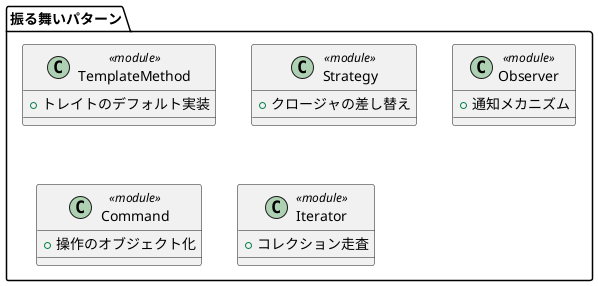
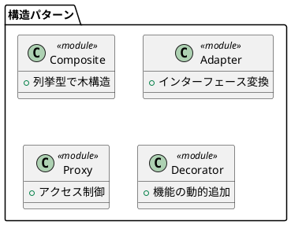
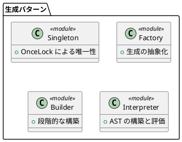

# 第 1 章：パターン入門

## はじめに

デザインパターンは、ソフトウェア設計で繰り返し現れる問題に対する再利用可能な解決策です。GoF（Gang of Four）の 23 パターンが有名ですが、本シリーズでは Rust の特性を活かして 13 のパターンを実装します。

Rust でデザインパターンを学ぶ意義は、所有権システムとトレイトという言語機能がパターンの実装をどのように変えるかを理解することにあります。

## パターンの分類

本シリーズで扱うパターンは以下の 3 カテゴリに分類されます。

### 振る舞いに関するパターン

オブジェクト間の責務の割り当てとコミュニケーションに焦点を当てます。

### 構造に関するパターン

クラスやオブジェクトを組み合わせて、より大きな構造を作ります。

### 生成に関するパターン

オブジェクトの生成メカニズムを扱います。

## Rust でパターンを学ぶ利点

1. **所有権による安全性** — メモリリークやダングリングポインタを言語レベルで防止
2. **トレイトによる抽象化** — 継承ではなくトレイトでポリモーフィズムを実現
3. **列挙型による型安全性** — パターンマッチで網羅的な分岐を保証
4. **ゼロコスト抽象化** — パターン適用による実行時オーバーヘッドが最小

## まとめ

デザインパターンは「車輪の再発明」を防ぎ、チーム内の共通語彙を提供します。Rust では、所有権・トレイト・列挙型という言語機能がパターン実装の根幹を担います。次章では Rust の基礎文法と `cargo test` を使った TDD の始め方を学びます。
