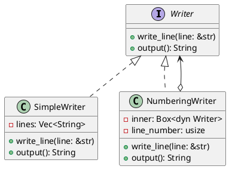
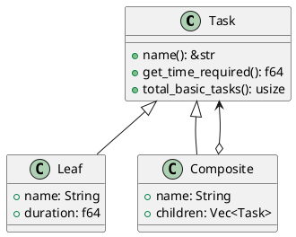

# 第 3 章：所有権・トレイト・列挙型

## はじめに

Rust のデザインパターン実装を支える 3 つの柱 — 所有権（Ownership）、トレイト（Trait）、列挙型（Enum）を解説します。これらは他の言語にはない Rust 独自の強みであり、パターン実装のアプローチを根本から変えます。

## 所有権と借用

### 所有権の基本ルール

1. Rust の各値には「所有者」が 1 つだけ存在する
2. 所有者がスコープを抜けると、値は自動的に解放される
3. 所有権は移動（move）できる

```rust
let s1 = String::from("hello");
let s2 = s1;  // s1 の所有権が s2 に移動
// s1 は使えなくなる
```

### 借用

```rust
fn print_length(s: &str) {  // 不変借用
    println!("{}", s.len());
}

fn append(s: &mut String) {  // 可変借用
    s.push_str(" world");
}
```

## トレイト

トレイトは Rust のポリモーフィズムの基盤です。Java のインターフェース + デフォルト実装に近い概念です。



### 静的ディスパッチと動的ディスパッチ

```rust
// 静的ディスパッチ（ジェネリクス）— コンパイル時に型が決定
fn process<W: Writer>(writer: &W) { ... }

// 動的ディスパッチ（トレイトオブジェクト）— 実行時に型が決定
fn process(writer: &dyn Writer) { ... }
fn process(writer: Box<dyn Writer>) { ... }
```

## 列挙型

Rust の列挙型は代数的データ型（ADT）であり、各バリアントがデータを持てます。



```rust
enum Task {
    Leaf { name: String, duration: f64 },
    Composite { name: String, children: Vec<Task> },
}
```

### パターンマッチ

```rust
match task {
    Task::Leaf { duration, .. } => *duration,
    Task::Composite { children, .. } => {
        children.iter().map(|c| c.get_time_required()).sum()
    }
}
```

## パターン実装への影響

| 概念 | 他言語のアプローチ | Rust のアプローチ |
|------|-------------------|------------------|
| ポリモーフィズム | 継承 + インターフェース | トレイト + トレイトオブジェクト |
| 木構造 | クラス階層 | 列挙型 + 再帰 |
| コールバック | インターフェース / ラムダ | クロージャ + `Fn` トレイト |
| シングルトン | `static` フィールド | `OnceLock` |
| null 安全 | Optional / null チェック | `Option<T>` |

## まとめ

所有権はリソース管理を安全にし、トレイトは柔軟な抽象化を提供し、列挙型はデータ構造を型安全に表現します。この 3 つの概念を理解することで、Rust らしいデザインパターンの実装が可能になります。次章から具体的なパターン実装に入ります。
