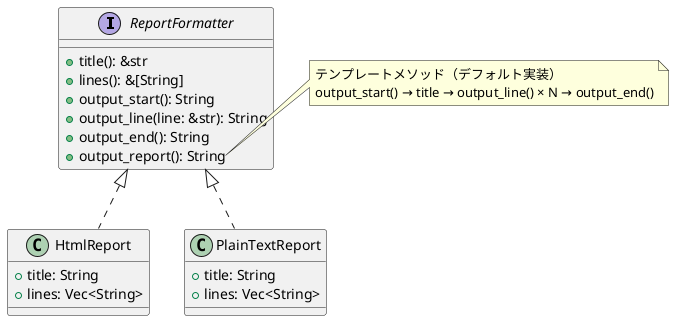

# 第 4 章：Template Method

## はじめに

Template Method パターンは、アルゴリズムの骨格を親クラスで定義し、具体的なステップをサブクラスに委譲するパターンです。Rust ではトレイトのデフォルト実装でこれを実現します。

## パターンの構造



## TDD で作る

### Red: テストを書く

```rust
#[test]
fn html_report_contains_html_tags() {
    let report = HtmlReport::new("Monthly Report", sample_lines());
    let output = report.output_report();
    assert!(output.contains("<html>"));
    assert!(output.contains("</html>"));
}
```

### Green: 最小限の実装

```rust
pub trait ReportFormatter {
    fn title(&self) -> &str;
    fn lines(&self) -> &[String];
    fn output_start(&self) -> String;
    fn output_line(&self, line: &str) -> String;
    fn output_end(&self) -> String;

    // テンプレートメソッド
    fn output_report(&self) -> String {
        let mut result = self.output_start();
        result.push_str(&format!("  {}\n", self.title()));
        for line in self.lines() {
            result.push_str(&self.output_line(line));
        }
        result.push_str(&self.output_end());
        result
    }
}
```

### Refactor

`output_report()` がテンプレートメソッドとして、抽象的なステップ（`output_start`, `output_line`, `output_end`）を呼び出す構造が明確です。

## 他言語比較

| 言語 | テンプレートメソッドの実現方法 |
|------|---------------------------|
| Java | 抽象クラス + 抽象メソッド |
| Python | ABC + `@abstractmethod` |
| Ruby | メソッド内で未定義メソッドを呼ぶ |
| **Rust** | **トレイト + デフォルト実装** |

Rust では「継承」が存在しないため、トレイトのデフォルト実装がテンプレートメソッドの自然な表現になります。

## まとめ

Template Method パターンは、Rust のトレイトのデフォルト実装と完璧にマッチします。アルゴリズムの骨格をデフォルト実装で定義し、変動するステップを必須メソッドとして宣言することで、型安全なテンプレートメソッドが実現できます。
