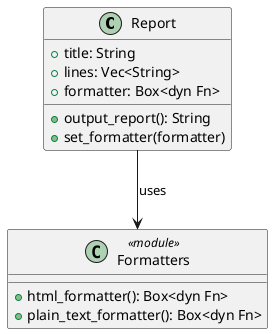

# 第 5 章：Strategy

## はじめに

Strategy パターンは、アルゴリズムをカプセル化し、実行時に差し替え可能にするパターンです。Rust ではクロージャと `Box<dyn Fn>` で軽量に実現できます。

## パターンの構造



## TDD で作る

### Red

```rust
#[test]
fn can_swap_formatter_at_runtime() {
    let mut report = Report::new("Test", sample_lines(), html_formatter());
    assert!(report.output_report().contains("<html>"));

    report.set_formatter(plain_text_formatter());
    assert!(!report.output_report().contains("<html>"));
}
```

### Green

```rust
pub struct Report {
    pub title: String,
    pub lines: Vec<String>,
    pub formatter: Box<dyn Fn(&str, &[String]) -> String>,
}
```

### Refactor

クロージャを使うことで、Strategy インターフェースのためだけにトレイトを定義する必要がなくなります。

## 他言語比較

| 言語 | Strategy の実現方法 |
|------|-------------------|
| Java | `interface` + 実装クラス |
| Python | 関数をオブジェクトとして渡す |
| Ruby | ブロック / Proc |
| **Rust** | **クロージャ + `Box<dyn Fn>`** |

## まとめ

Rust のクロージャは Strategy パターンの最も自然な表現です。`Box<dyn Fn>` でヒープに配置すれば、実行時の差し替えも容易です。トレイトベースのアプローチも可能ですが、単純なアルゴリズム切り替えにはクロージャが最適です。
