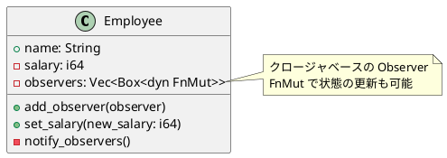

# 第 6 章：Observer

## はじめに

Observer パターンは、あるオブジェクトの状態変化を、登録された複数のオブジェクトに自動的に通知するパターンです。Rust ではクロージャのベクタで Observer リストを管理します。

## パターンの構造



## TDD で作る

### Red — 給与の取得

まず、`salary()` ゲッターメソッドで初期給与を取得できることを確認するテストから始めます。

```rust
#[test]
fn initial_salary() {
    let emp = Employee::new("Alice", 50_000);
    assert_eq!(emp.salary(), 50_000);
}
```

`salary` フィールドは `pub` ではなく非公開にし、ゲッターメソッド経由でアクセスします。これにより、外部から直接値を変更されることを防ぎ、`set_salary()` を通じた変更のみを許可できます。

```rust
pub fn salary(&self) -> i64 {
    self.salary
}
```

### Red — Observer 通知

```rust
#[test]
fn observer_is_notified_on_salary_change() {
    let log = Rc::new(RefCell::new(Vec::new()));
    let log_clone = Rc::clone(&log);

    let mut emp = Employee::new("Bob", 40_000);
    emp.add_observer(move |name, salary| {
        log_clone.borrow_mut().push(format!("{}: {}", name, salary));
    });

    emp.set_salary(45_000);
    assert_eq!(log.borrow()[0], "Bob: 45000");
}
```

### Green

```rust
type Observer = Box<dyn FnMut(&str, i64)>;

pub struct Employee {
    name: String,
    salary: i64,
    observers: Vec<Observer>,
}

impl Employee {
    pub fn new(name: &str, salary: i64) -> Self {
        Self {
            name: name.to_string(),
            salary,
            observers: Vec::new(),
        }
    }

    pub fn add_observer<F>(&mut self, observer: F)
    where
        F: FnMut(&str, i64) + 'static,
    {
        self.observers.push(Box::new(observer));
    }

    pub fn set_salary(&mut self, salary: i64) {
        self.salary = salary;
        self.notify_observers();
    }

    fn notify_observers(&mut self) {
        for observer in &mut self.observers {
            observer(&self.name, self.salary);
        }
    }
}
```

クロージャに `FnMut` を使うことで、通知先が内部ログやカウンタを更新するケースも自然に扱えます。

### 複数 Observer のテスト

1 人の Employee に複数の Observer を登録した場合、すべての Observer が通知を受けることを確認します。

```rust
#[test]
fn multiple_observers_all_notified() {
    let count1: Rc<RefCell<u32>> = Rc::new(RefCell::new(0));
    let count2: Rc<RefCell<u32>> = Rc::new(RefCell::new(0));
    let c1 = Rc::clone(&count1);
    let c2 = Rc::clone(&count2);

    let mut emp = Employee::new("Carol", 30_000);
    emp.add_observer(move |_, _| *c1.borrow_mut() += 1);
    emp.add_observer(move |_, _| *c2.borrow_mut() += 1);

    emp.set_salary(35_000);

    assert_eq!(*count1.borrow(), 1);
    assert_eq!(*count2.borrow(), 1);
}
```

このテストでは `Rc<RefCell<u32>>` でカウンタを共有し、各 Observer がそれぞれ独立して呼び出されることを検証しています。Observer の実装がベクタベースであるため、登録順に通知されます。

### Refactor

テスト内では `Rc<RefCell<>>` を使って Observer の状態を共有しますが、実装側は `FnMut` クロージャを受け取るだけのシンプルな設計です。

## 他言語比較

| 言語 | Observer の実現方法 |
|------|-------------------|
| Java | `Observer` インターフェース / イベントリスナー |
| Python | コールバック関数のリスト |
| Ruby | ブロック / Observable モジュール |
| **Rust** | **`Vec<Box<dyn FnMut>>` クロージャリスト** |

## まとめ

Rust の Observer パターンは、`FnMut` クロージャをベクタに格納することで実現します。所有権の制約により、Observer 側の状態共有には `Rc<RefCell<>>` が必要になりますが、これは Observer パターンの複雑さを型システムが明示してくれていると言えます。
