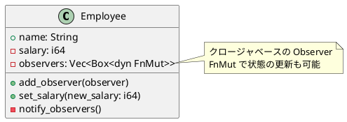

# 第 6 章：Observer

## はじめに

Observer パターンは、あるオブジェクトの状態変化を、登録された複数のオブジェクトに自動的に通知するパターンです。Rust ではクロージャのベクタで Observer リストを管理します。

## パターンの構造



## TDD で作る

### Red

```rust
#[test]
fn observer_is_notified_on_salary_change() {
    let log = Rc::new(RefCell::new(Vec::new()));
    let log_clone = Rc::clone(&log);

    let mut emp = Employee::new("Bob", 40_000);
    emp.add_observer(move |name, salary| {
        log_clone.borrow_mut().push(format!("{}: {}", name, salary));
    });

    emp.set_salary(45_000);
    assert_eq!(log.borrow()[0], "Bob: 45000");
}
```

### Green

`Employee` 構造体にクロージャのベクタを持たせ、`set_salary()` 内で全オブザーバを呼び出します。

### Refactor

テスト内では `Rc<RefCell<>>` を使って Observer の状態を共有しますが、実装側は `FnMut` クロージャを受け取るだけのシンプルな設計です。

## 他言語比較

| 言語 | Observer の実現方法 |
|------|-------------------|
| Java | `Observer` インターフェース / イベントリスナー |
| Python | コールバック関数のリスト |
| Ruby | ブロック / Observable モジュール |
| **Rust** | **`Vec<Box<dyn FnMut>>` クロージャリスト** |

## まとめ

Rust の Observer パターンは、`FnMut` クロージャをベクタに格納することで実現します。所有権の制約により、Observer 側の状態共有には `Rc<RefCell<>>` が必要になりますが、これは Observer パターンの複雑さを型システムが明示してくれていると言えます。
