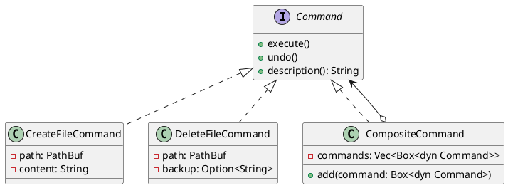

# 第 7 章：Command

## はじめに

Command パターンは、操作をオブジェクトとしてカプセル化し、実行（execute）と取り消し（undo）を可能にするパターンです。

## パターンの構造



## TDD で作る

### Red

```rust
#[test]
fn create_file_command_creates_and_undoes() {
    let path = temp_path("test.txt");
    let mut cmd = CreateFileCommand::new(&path, "hello");
    cmd.execute();
    assert!(path.exists());
    cmd.undo();
    assert!(!path.exists());
}
```

### Green

```rust
pub trait Command {
    fn execute(&mut self) -> std::io::Result<()>;
    fn undo(&mut self) -> std::io::Result<()>;
    fn description(&self) -> String;
}

pub struct CreateFileCommand {
    path: PathBuf,
    content: String,
}

impl Command for CreateFileCommand {
    fn execute(&mut self) -> std::io::Result<()> {
        fs::write(&self.path, &self.content)
    }

    fn undo(&mut self) -> std::io::Result<()> {
        fs::remove_file(&self.path)
    }

    fn description(&self) -> String {
        format!("create {}", self.path.display())
    }
}

pub struct DeleteFileCommand {
    path: PathBuf,
    backup: Option<String>,
}

impl Command for DeleteFileCommand {
    fn execute(&mut self) -> std::io::Result<()> {
        self.backup = Some(fs::read_to_string(&self.path)?);
        fs::remove_file(&self.path)
    }

    fn undo(&mut self) -> std::io::Result<()> {
        if let Some(content) = &self.backup {
            fs::write(&self.path, content)?;
        }
        Ok(())
    }

    fn description(&self) -> String {
        format!("delete {}", self.path.display())
    }
}
```

まず単体コマンドを実装し、その上に `Vec<Box<dyn Command>>` を持つ `CompositeCommand` を積み上げるのが素直です。

### Refactor

`CompositeCommand` により、複数のコマンドをまとめて実行・取り消しできます。`undo()` では逆順に取り消します。

## 他言語比較

| 言語 | Command の実現方法 |
|------|------------------|
| Java | `Command` インターフェース + 実装クラス |
| Python | クラスまたは関数オブジェクト |
| Ruby | Proc / コマンドオブジェクト |
| **Rust** | **`Command` トレイト + `Box<dyn Command>`** |

## まとめ

Rust の Command パターンは、トレイトオブジェクト (`Box<dyn Command>`) でポリモーフィズムを実現します。`DeleteFileCommand` の `backup: Option<String>` は、Rust の `Option` 型が「状態があるかないか」を型安全に表現する好例です。
