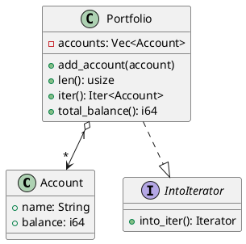

# 第 8 章：Iterator

## はじめに

Iterator パターンは、コレクションの内部構造を公開せずに要素を順番に走査するパターンです。Rust では標準ライブラリの `Iterator` トレイトと `IntoIterator` トレイトが言語に深く統合されています。

## パターンの構造



## TDD で作る

### Red

```rust
#[test]
fn for_loop_works_via_into_iterator() {
    let p = sample_portfolio();
    let mut count = 0;
    for _account in &p {
        count += 1;
    }
    assert_eq!(count, 3);
}
```

### Green

```rust
#[derive(Debug, Clone)]
pub struct Account {
    pub name: String,
    pub balance: i64,
}

pub struct Portfolio {
    accounts: Vec<Account>,
}

impl Portfolio {
    pub fn new(accounts: Vec<Account>) -> Self {
        Self { accounts }
    }

    pub fn add_account(&mut self, account: Account) {
        self.accounts.push(account);
    }

    pub fn iter(&self) -> std::slice::Iter<'_, Account> {
        self.accounts.iter()
    }

    pub fn total_balance(&self) -> i64 {
        self.accounts.iter().map(|a| a.balance).sum()
    }
}

impl<'a> IntoIterator for &'a Portfolio {
    type Item = &'a Account;
    type IntoIter = std::slice::Iter<'a, Account>;

    fn into_iter(self) -> Self::IntoIter {
        self.accounts.iter()
    }
}
```

#### コレクション操作メソッド

`Portfolio` には、標準的なコレクション操作メソッドも実装されています。

```rust
pub fn len(&self) -> usize {
    self.accounts.len()
}

pub fn is_empty(&self) -> bool {
    self.accounts.is_empty()
}

pub fn total_balance(&self) -> i64 {
    self.iter().map(|a| a.balance).sum()
}
```

`len()` と `is_empty()` は Rust のコレクション型の慣習に従ったメソッドです。`is_empty()` を提供しないと Clippy が警告を出します（`len_without_is_empty` lint）。

`total_balance()` はイテレータアダプタを活用した集約メソッドです。`iter().map().sum()` というチェーンで、ループを書かずに合計値を算出しています。

```rust
#[test]
fn empty_portfolio() {
    let p = Portfolio::new();
    assert!(p.is_empty());
    assert_eq!(p.len(), 0);
}

#[test]
fn total_balance_sums_all_accounts() {
    let p = sample_portfolio();
    assert_eq!(p.total_balance(), 8000);
}
```

また、`Portfolio` には `Default` トレイトも実装されており、`Portfolio::default()` で空のポートフォリオを作成できます。

```rust
impl Default for Portfolio {
    fn default() -> Self {
        Self::new()
    }
}
```

`&Portfolio` に `IntoIterator` を実装しておくと、所有権を消費せずに `for account in &portfolio` と書けます。

### Refactor

`iter()` メソッドを公開し、`map`, `filter`, `sum` などのイテレータアダプタを活用できるようにします。

## 他言語比較

| 言語 | Iterator の実現方法 |
|------|-------------------|
| Java | `Iterable<T>` + `Iterator<T>` |
| Python | `__iter__` + `__next__` |
| Ruby | `Enumerable` + `each` |
| **Rust** | **`IntoIterator` + `Iterator` トレイト** |

Rust の Iterator は遅延評価（lazy）であり、`collect()` するまで実際の計算は行われません。

## まとめ

Rust の Iterator パターンは言語に組み込まれており、`IntoIterator` を実装するだけで `for` ループやイテレータアダプタ（`map`, `filter`, `fold` 等）がすべて使えるようになります。カスタムコレクションでも Rust の慣用的な方法で走査を提供できます。
