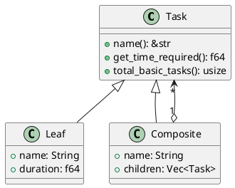

# 第 9 章：Composite

## はじめに

Composite パターンは、個々のオブジェクトとオブジェクトの集合を同一視して扱うパターンです。Rust では列挙型（enum）で木構造を自然に表現できます。

## パターンの構造



## TDD で作る

### Red

```rust
#[test]
fn nested_composite_works_recursively() {
    let inner = Task::new_composite("Backend", vec![
        Task::new_leaf("API", 4.0),
        Task::new_leaf("DB", 3.0),
    ]);
    let outer = Task::new_composite("Project", vec![inner, Task::new_leaf("Frontend", 6.0)]);
    assert_eq!(outer.get_time_required(), 13.0);
    assert_eq!(outer.total_basic_tasks(), 3);
}
```

### Green

```rust
pub enum Task {
    Leaf { name: String, duration: f64 },
    Composite { name: String, children: Vec<Task> },
}
```

`get_time_required()` は再帰的に子要素の合計を計算します。

### Refactor

列挙型を使うことで、「Leaf か Composite か」の判定がパターンマッチで網羅的に行われ、新しいバリアントを追加した際にコンパイラが未処理のケースを指摘してくれます。

## 他言語比較

| 言語 | Composite の実現方法 |
|------|-------------------|
| Java | 抽象クラス + 継承 |
| Python | 基底クラス + サブクラス |
| Ruby | ダックタイピング |
| **Rust** | **列挙型 + パターンマッチ** |

## まとめ

Rust の列挙型は Composite パターンの最適な表現です。ヒープ割り当てが `Vec` 内で管理され、再帰的な構造も安全に扱えます。パターンマッチによる網羅性チェックは、バグの早期発見に貢献します。
