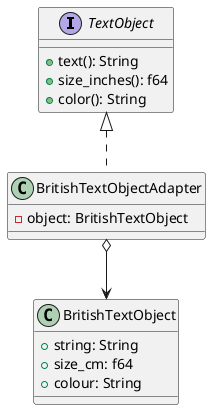

# 第 10 章：Adapter

## はじめに

Adapter パターンは、既存のインターフェースを別のインターフェースに変換し、互換性のないクラスを協調させるパターンです。

## パターンの構造



## TDD で作る

### Red

```rust
#[test]
fn adapter_converts_cm_to_inches() {
    let british = BritishTextObject::new("Test", 2.54, "blue");
    let adapter = BritishTextObjectAdapter::new(british);
    assert!((adapter.size_inches() - 1.0).abs() < 0.001);
}
```

### Green

アダプタは `BritishTextObject` を所有し、`TextObject` トレイトを実装します。`size_inches()` 内で `size_cm / 2.54` の変換を行います。

### Refactor

変換ロジックがアダプタに集約され、元の `BritishTextObject` を変更する必要がありません。

## 他言語比較

| 言語 | Adapter の実現方法 |
|------|------------------|
| Java | ラッパークラス + インターフェース実装 |
| Python | ラッパークラス / `__getattr__` |
| Ruby | ラッパー + メソッド委譲 |
| **Rust** | **所有による委譲 + トレイト実装** |

Rust では「所有」によりアダプタがアダプティを完全に内包するため、ライフタイムの管理が明確です。

## まとめ

Adapter パターンは、トレイトによるインターフェース定義と構造体による所有で、Rust らしく実装できます。所有権により、アダプタとアダプティの関係が型システムで明示されます。
