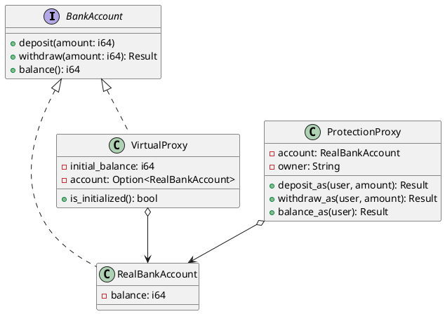

# 第 11 章：Proxy

## はじめに

Proxy パターンは、別のオブジェクトへのアクセスを制御する代理オブジェクトを提供するパターンです。本章では Protection Proxy（アクセス制御）と Virtual Proxy（遅延初期化）を実装します。

## パターンの構造



## TDD で作る

### Red

```rust
#[test]
fn protection_proxy_denies_non_owner() {
    let acc = RealBankAccount::new(100);
    let mut proxy = ProtectionProxy::new(acc, "alice");
    assert!(proxy.deposit_as("bob", 50).is_err());
}

#[test]
fn virtual_proxy_delays_initialization() {
    let proxy = VirtualProxy::new(100);
    assert!(!proxy.is_initialized());
    assert_eq!(proxy.balance(), 100);
}
```

### Green

`ProtectionProxy` はオーナーチェックを行い、不正アクセスを `Result::Err` で返します。`VirtualProxy` は `Option<RealBankAccount>` を使い、最初のアクセス時に初期化します。

### Refactor

`Result` 型でエラーを表現することで、呼び出し側がエラーハンドリングを強制されます。

## 他言語比較

| 言語 | Proxy の実現方法 |
|------|----------------|
| Java | インターフェース + 委譲 / `java.lang.reflect.Proxy` |
| Python | `__getattr__` / デコレータ |
| Ruby | `method_missing` / `BasicObject` |
| **Rust** | **トレイト + `Option` による遅延初期化 + `Result` によるエラー** |

## まとめ

Rust の `Option` 型は Virtual Proxy の「まだ初期化されていない」状態を型安全に表現し、`Result` 型は Protection Proxy のアクセス拒否を明示的にハンドリング可能にします。
