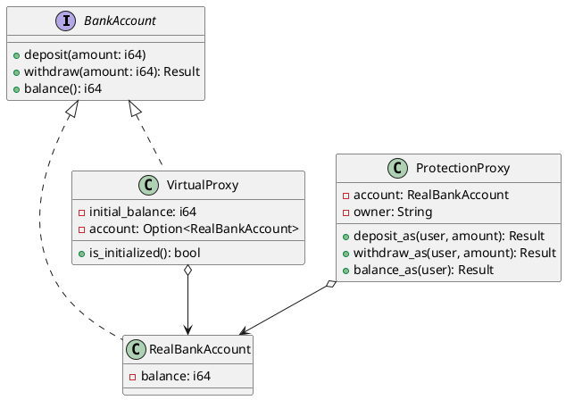

# 第 11 章：Proxy

## はじめに

Proxy パターンは、別のオブジェクトへのアクセスを制御する代理オブジェクトを提供するパターンです。本章では Protection Proxy（アクセス制御）と Virtual Proxy（遅延初期化）を実装します。

## パターンの構造



## TDD で作る

### Red

```rust
#[test]
fn protection_proxy_denies_non_owner() {
    let acc = RealBankAccount::new(100);
    let mut proxy = ProtectionProxy::new(acc, "alice");
    assert!(proxy.deposit_as("bob", 50).is_err());
}

#[test]
fn virtual_proxy_delays_initialization() {
    let proxy = VirtualProxy::new(100);
    assert!(!proxy.is_initialized());
    assert_eq!(proxy.balance(), 100);
}
```

### Green

```rust
pub trait BankAccount {
    fn deposit(&mut self, amount: i64);
    fn withdraw(&mut self, amount: i64) -> Result<(), String>;
    fn balance(&self) -> i64;
}

pub struct RealBankAccount {
    balance: i64,
}

impl BankAccount for RealBankAccount {
    fn deposit(&mut self, amount: i64) {
        self.balance += amount;
    }

    fn withdraw(&mut self, amount: i64) -> Result<(), String> {
        if self.balance < amount {
            return Err("insufficient funds".into());
        }
        self.balance -= amount;
        Ok(())
    }

    fn balance(&self) -> i64 {
        self.balance
    }
}

pub struct ProtectionProxy {
    account: RealBankAccount,
    owner: String,
}

impl ProtectionProxy {
    fn check_access(&self, user: &str) -> Result<(), String> {
        if user == self.owner {
            Ok(())
        } else {
            Err(format!("Access denied for user: {}", user))
        }
    }

    pub fn deposit_as(&mut self, user: &str, amount: i64) -> Result<(), String> {
        self.check_access(user)?;
        self.account.deposit(amount);
        Ok(())
    }

    pub fn withdraw_as(&mut self, user: &str, amount: i64) -> Result<(), String> {
        self.check_access(user)?;
        self.account.withdraw(amount)
    }

    pub fn balance_as(&self, user: &str) -> Result<i64, String> {
        self.check_access(user)?;
        Ok(self.account.balance())
    }
}

pub struct VirtualProxy {
    initial_balance: i64,
    account: Option<RealBankAccount>,
}

impl VirtualProxy {
    fn ensure_initialized(&mut self) -> &mut RealBankAccount {
        self.account.get_or_insert_with(|| RealBankAccount {
            balance: self.initial_balance,
        })
    }
}
```

`check_access()` ヘルパーメソッドでアクセス制御ロジックを一元化しています。各操作メソッド（`deposit_as`, `withdraw_as`, `balance_as`）は `?` 演算子で `check_access()` のエラーを伝播させ、認可チェックの重複を排除しています。

#### VirtualProxy の BankAccount トレイト実装

`VirtualProxy` は `BankAccount` トレイトを実装しており、`RealBankAccount` と同じインターフェースで操作できます。`ensure_account()` で遅延初期化を行い、初回アクセス時にのみ実体を生成します。

```rust
impl BankAccount for VirtualProxy {
    fn deposit(&mut self, amount: i64) {
        self.ensure_account().deposit(amount);
    }

    fn withdraw(&mut self, amount: i64) -> Result<(), String> {
        self.ensure_account().withdraw(amount)
    }

    fn balance(&self) -> i64 {
        match &self.account {
            Some(acc) => acc.balance(),
            None => self.initial_balance,
        }
    }
}
```

`balance()` メソッドは `&self`（不変参照）のため `ensure_account()` を呼べません。代わりに `Option` のパターンマッチで、未初期化時は `initial_balance` を返します。これにより、残高照会だけでは実体が生成されないという Virtual Proxy の意図が正確に表現されています。

Protection Proxy と Virtual Proxy は目的が異なるため、責務を分けて別構造体にする方が読みやすくなります。

### Refactor

`Result` 型でエラーを表現することで、呼び出し側がエラーハンドリングを強制されます。

## 他言語比較

| 言語 | Proxy の実現方法 |
|------|----------------|
| Java | インターフェース + 委譲 / `java.lang.reflect.Proxy` |
| Python | `__getattr__` / デコレータ |
| Ruby | `method_missing` / `BasicObject` |
| **Rust** | **トレイト + `Option` による遅延初期化 + `Result` によるエラー** |

## まとめ

Rust の `Option` 型は Virtual Proxy の「まだ初期化されていない」状態を型安全に表現し、`Result` 型は Protection Proxy のアクセス拒否を明示的にハンドリング可能にします。
