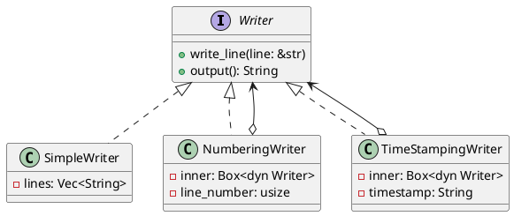

# 第 12 章：Decorator

## はじめに

Decorator パターンは、オブジェクトに動的に新しい責務を追加するパターンです。Rust ではトレイトオブジェクト (`Box<dyn Writer>`) でデコレータのチェーンを構成します。

## パターンの構造



## TDD で作る

### Red

```rust
#[test]
fn decorators_can_be_stacked() {
    let simple = Box::new(SimpleWriter::new());
    let numbered = Box::new(NumberingWriter::new(simple));
    let mut stamped = TimeStampingWriter::new(numbered, "09:00");
    stamped.write_line("hello");
    assert_eq!(stamped.output(), "1: [09:00] hello");
}
```

### Green

```rust
pub trait Writer {
    fn write_line(&mut self, line: &str);
    fn output(&self) -> String;
}

pub struct SimpleWriter {
    lines: Vec<String>,
}

impl Writer for SimpleWriter {
    fn write_line(&mut self, line: &str) {
        self.lines.push(line.to_string());
    }

    fn output(&self) -> String {
        self.lines.join("\n")
    }
}

pub struct NumberingWriter {
    inner: Box<dyn Writer>,
    line_number: usize,
}

impl Writer for NumberingWriter {
    fn write_line(&mut self, line: &str) {
        self.line_number += 1;
        self.inner
            .write_line(&format!("{}: {}", self.line_number, line));
    }

    fn output(&self) -> String {
        self.inner.output()
    }
}

pub struct TimeStampingWriter {
    inner: Box<dyn Writer>,
    timestamp: String,
}

impl Writer for TimeStampingWriter {
    fn write_line(&mut self, line: &str) {
        self.inner
            .write_line(&format!("[{}] {}", self.timestamp, line));
    }

    fn output(&self) -> String {
        self.inner.output()
    }
}
```

デコレータ自身は出力を保持せず、常に内側の Writer に委譲することで責務を単純化できます。

### Refactor

デコレータの積み重ね順序を変えるだけで、出力形式が変わります。これが Decorator パターンの柔軟性です。

## 他言語比較

| 言語 | Decorator の実現方法 |
|------|-------------------|
| Java | 抽象クラス + ラッパー（`InputStream` 等） |
| Python | `@decorator` 構文 |
| Ruby | `SimpleDelegator` / モジュール |
| **Rust** | **`Box<dyn Trait>` による委譲チェーン** |

## まとめ

Rust の Decorator パターンは、`Box<dyn Writer>` でトレイトオブジェクトをラップすることで実現します。所有権により、デコレータチェーンの各層が次の層を「所有」する構造が明確になります。
