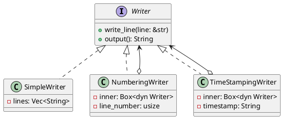

# 第 12 章：Decorator

## はじめに

Decorator パターンは、オブジェクトに動的に新しい責務を追加するパターンです。Rust ではトレイトオブジェクト (`Box<dyn Writer>`) でデコレータのチェーンを構成します。

## パターンの構造



## TDD で作る

### Red

```rust
#[test]
fn decorators_can_be_stacked() {
    let simple = Box::new(SimpleWriter::new());
    let numbered = Box::new(NumberingWriter::new(simple));
    let mut stamped = TimeStampingWriter::new(numbered, "09:00");
    stamped.write_line("hello");
    assert_eq!(stamped.output(), "1: [09:00] hello");
}
```

### Green

各デコレータは `inner: Box<dyn Writer>` を持ち、`write_line()` で加工してから内部の Writer に委譲します。

### Refactor

デコレータの積み重ね順序を変えるだけで、出力形式が変わります。これが Decorator パターンの柔軟性です。

## 他言語比較

| 言語 | Decorator の実現方法 |
|------|-------------------|
| Java | 抽象クラス + ラッパー（`InputStream` 等） |
| Python | `@decorator` 構文 |
| Ruby | `SimpleDelegator` / モジュール |
| **Rust** | **`Box<dyn Trait>` による委譲チェーン** |

## まとめ

Rust の Decorator パターンは、`Box<dyn Writer>` でトレイトオブジェクトをラップすることで実現します。所有権により、デコレータチェーンの各層が次の層を「所有」する構造が明確になります。
