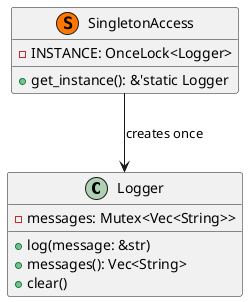

# 第 13 章：Singleton

## はじめに

Singleton パターンは、クラスのインスタンスが 1 つだけ存在することを保証するパターンです。Rust では `std::sync::OnceLock` を使ってスレッドセーフに実現します。

## パターンの構造



## TDD で作る

### Red

```rust
#[test]
fn singleton_returns_same_instance() {
    let logger1 = get_instance();
    let logger2 = get_instance();
    assert!(std::ptr::eq(logger1, logger2));
}
```

### Green

```rust
use std::sync::{Mutex, OnceLock};

pub struct Logger {
    messages: Mutex<Vec<String>>,
}

impl Logger {
    pub fn new() -> Self {
        Self {
            messages: Mutex::new(Vec::new()),
        }
    }

    pub fn log(&self, message: &str) {
        self.messages.lock().unwrap().push(message.to_string());
    }

    pub fn messages(&self) -> Vec<String> {
        self.messages
            .lock()
            .expect("Logger mutex poisoned")
            .clone()
    }

    pub fn clear(&self) {
        self.messages
            .lock()
            .expect("Logger mutex poisoned")
            .clear();
    }
}

static INSTANCE: OnceLock<Logger> = OnceLock::new();

pub fn get_instance() -> &'static Logger {
    INSTANCE.get_or_init(Logger::new)
}
```

`messages()` ゲッターは `Mutex` をロックして内部の `Vec<String>` を `clone()` で返します。`clear()` メソッドはテスト間の状態リセットに使用します。Singleton はグローバル状態を共有するため、テストの独立性を保つにはテスト前後で `clear()` を呼ぶことが重要です。

```rust
#[test]
fn logger_stores_messages() {
    let logger = get_instance();
    logger.clear();
    logger.log("test message");
    let msgs = logger.messages();
    assert!(msgs.contains(&"test message".to_string()));
}

#[test]
fn logger_clear_removes_all_messages() {
    let logger = get_instance();
    logger.log("to be cleared");
    logger.clear();
    assert!(logger.messages().is_empty());
}
```

`Logger` 自体は通常の構造体として保ち、唯一性の保証だけを `OnceLock` に任せると見通しがよくなります。

### Refactor

`OnceLock` は Rust 1.80 以降の標準ライブラリで提供され、`once_cell` クレートの `Lazy` に代わるスレッドセーフな初期化手段です。内部の `Vec` は `Mutex` で保護します。

## 他言語比較

| 言語 | Singleton の実現方法 |
|------|-------------------|
| Java | `private` コンストラクタ + `static getInstance()` |
| Python | モジュールレベル変数 / `__new__` |
| Ruby | `Singleton` モジュール |
| **Rust** | **`OnceLock` + `&'static` 参照** |

## まとめ

Rust の Singleton は `OnceLock` により、初期化の一回性とスレッド安全性を言語レベルで保証します。`'static` ライフタイムにより、返される参照がプログラム全体で有効であることが型で表現されます。
