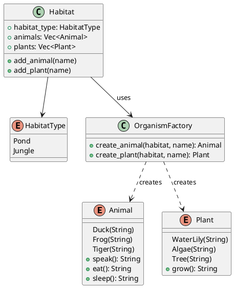

# 第 14 章：Factory

## はじめに

Factory パターンは、オブジェクトの生成ロジックを専用のファクトリに委譲するパターンです。Rust では列挙型とファクトリ関数で型安全に実現します。

## パターンの構造



## TDD で作る

### Red

```rust
#[test]
fn pond_creates_ducks() {
    let animal = OrganismFactory::create_animal(HabitatType::Pond, "Donald");
    assert_eq!(animal.speak(), "Quack!");
}
```

### Green

```rust
pub enum HabitatType {
    Pond,
    Jungle,
}

pub enum Animal {
    Duck(String),
    Frog(String),
    Tiger(String),
}

impl Animal {
    pub fn speak(&self) -> &'static str {
        match self {
            Animal::Duck(_) => "Quack!",
            Animal::Frog(_) => "Ribbit!",
            Animal::Tiger(_) => "Roar!",
        }
    }
}

pub enum Plant {
    WaterLily(String),
    Algae(String),
    Tree(String),
}

pub struct OrganismFactory;

impl OrganismFactory {
    pub fn create_animal(habitat: HabitatType, name: &str) -> Animal {
        match habitat {
            HabitatType::Pond => Animal::Duck(name.to_string()),
            HabitatType::Jungle => Animal::Tiger(name.to_string()),
        }
    }

    pub fn create_plant(habitat: HabitatType, name: &str) -> Plant {
        match habitat {
            HabitatType::Pond => Plant::WaterLily(name.to_string()),
            HabitatType::Jungle => Plant::Tree(name.to_string()),
        }
    }
}
```

#### Animal の振る舞いメソッド

`Animal` 列挙型には `speak()` のほか、`name()`、`eat()`、`sleep()` メソッドも実装されています。

```rust
impl Animal {
    pub fn name(&self) -> &str {
        match self {
            Animal::Duck(n) | Animal::Frog(n) | Animal::Tiger(n) => n,
        }
    }

    pub fn eat(&self) -> String {
        match self {
            Animal::Duck(_) => "Eats bread crumbs".to_string(),
            Animal::Frog(_) => "Eats flies".to_string(),
            Animal::Tiger(_) => "Eats meat".to_string(),
        }
    }

    pub fn sleep(&self) -> String {
        match self {
            Animal::Duck(_) => "Sleeps on water".to_string(),
            Animal::Frog(_) => "Sleeps on lily pad".to_string(),
            Animal::Tiger(_) => "Sleeps in den".to_string(),
        }
    }
}
```

`name()` では `|`（or パターン）を使い、すべてのバリアントから共通の `String` フィールドを取り出しています。テストでは各動物の振る舞いを検証しています。

```rust
#[test]
fn animal_behaviors() {
    let frog = Animal::Frog("Kermit".to_string());
    assert_eq!(frog.speak(), "Croak!");
    assert_eq!(frog.eat(), "Eats flies");
    assert_eq!(frog.sleep(), "Sleeps on lily pad");
}
```

#### Plant のメソッド

`Plant` 列挙型にも `name()` と `grow()` メソッドが実装されています。

```rust
impl Plant {
    pub fn name(&self) -> &str {
        match self {
            Plant::WaterLily(n) | Plant::Algae(n) | Plant::Tree(n) => n,
        }
    }

    pub fn grow(&self) -> String {
        match self {
            Plant::WaterLily(_) => "Grows on water surface".to_string(),
            Plant::Algae(_) => "Grows underwater".to_string(),
            Plant::Tree(_) => "Grows on land".to_string(),
        }
    }
}
```

#### Habitat コンストラクタ

`Habitat` 構造体には `new()` コンストラクタがあり、生息地の種類を指定して空の生息地を作成します。

```rust
impl Habitat {
    pub fn new(habitat_type: HabitatType) -> Self {
        Self {
            habitat_type,
            animals: Vec::new(),
            plants: Vec::new(),
        }
    }
}
```

`add_animal()` と `add_plant()` は内部で `OrganismFactory` を呼び出し、生息地に応じた生物を自動的に生成します。

生成ロジックを `match` に集約することで、環境の追加時に必要な分岐をコンパイラに洗い出させられます。

### Refactor

`Habitat` 構造体がファクトリを利用することで、生息地の種類に応じた生物群を一貫して生成できます。

## 他言語比較

| 言語 | Factory の実現方法 |
|------|------------------|
| Java | Factory Method / Abstract Factory |
| Python | クラスメソッド / ファクトリ関数 |
| Ruby | クラスメソッド |
| **Rust** | **列挙型 + ファクトリ関数** |

## まとめ

Rust の列挙型は Factory パターンと相性が良く、`match` による網羅的なパターンマッチでバリアントの追加漏れを防ぎます。ファクトリ関数が `enum` を返すことで、戻り値の型が統一され、トレイトオブジェクト (`Box<dyn Trait>`) のオーバーヘッドを回避できます。
