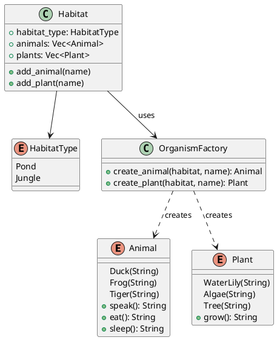

# 第 14 章：Factory

## はじめに

Factory パターンは、オブジェクトの生成ロジックを専用のファクトリに委譲するパターンです。Rust では列挙型とファクトリ関数で型安全に実現します。

## パターンの構造



## TDD で作る

### Red

```rust
#[test]
fn pond_creates_ducks() {
    let animal = OrganismFactory::create_animal(HabitatType::Pond, "Donald");
    assert_eq!(animal.speak(), "Quack!");
}
```

### Green

`OrganismFactory` は `HabitatType` に基づいて適切な `Animal` / `Plant` バリアントを生成します。

### Refactor

`Habitat` 構造体がファクトリを利用することで、生息地の種類に応じた生物群を一貫して生成できます。

## 他言語比較

| 言語 | Factory の実現方法 |
|------|------------------|
| Java | Factory Method / Abstract Factory |
| Python | クラスメソッド / ファクトリ関数 |
| Ruby | クラスメソッド |
| **Rust** | **列挙型 + ファクトリ関数** |

## まとめ

Rust の列挙型は Factory パターンと相性が良く、`match` による網羅的なパターンマッチでバリアントの追加漏れを防ぎます。ファクトリ関数が `enum` を返すことで、戻り値の型が統一され、トレイトオブジェクト (`Box<dyn Trait>`) のオーバーヘッドを回避できます。
