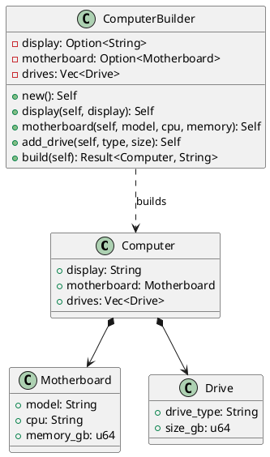

# 第 15 章：Builder

## はじめに

Builder パターンは、複雑なオブジェクトの構築を段階的に行うパターンです。Rust ではメソッドチェーン（consuming self パターン）と `Result` 型で安全に構築します。

## パターンの構造



## TDD で作る

### Red

```rust
#[test]
fn build_fails_without_display() {
    let result = ComputerBuilder::new()
        .motherboard("Basic", "i5", 16)
        .build();
    assert!(result.is_err());
}
```

### Green

```rust
pub struct ComputerBuilder {
    display: Option<String>,
    motherboard: Option<Motherboard>,
    drives: Vec<Drive>,
}

impl ComputerBuilder {
    pub fn new() -> Self {
        Self {
            display: None,
            motherboard: None,
            drives: Vec::new(),
        }
    }

    pub fn display(mut self, display: &str) -> Self {
        self.display = Some(display.to_string());
        self
    }

    pub fn motherboard(mut self, model: &str, cpu: &str, memory_gb: u64) -> Self {
        self.motherboard = Some(Motherboard {
            model: model.to_string(),
            cpu: cpu.to_string(),
            memory_gb,
        });
        self
    }

    pub fn add_drive(mut self, drive_type: &str, size_gb: u64) -> Self {
        self.drives.push(Drive {
            drive_type: drive_type.to_string(),
            size_gb,
        });
        self
    }

    pub fn build(self) -> Result<Computer, String> {
        Ok(Computer {
            display: self.display.ok_or("display is required")?,
            motherboard: self.motherboard.ok_or("motherboard is required")?,
            drives: self.drives,
        })
    }
}
```

#### Drive と Motherboard のコンストラクタ

`Drive` と `Motherboard` にはそれぞれ `new()` コンストラクタが用意されています。

```rust
impl Drive {
    pub fn new(drive_type: &str, size_gb: u64) -> Self {
        Self {
            drive_type: drive_type.to_string(),
            size_gb,
        }
    }
}

impl Motherboard {
    pub fn new(model: &str, cpu: &str, memory_gb: u64) -> Self {
        Self {
            model: model.to_string(),
            cpu: cpu.to_string(),
            memory_gb,
        }
    }
}
```

Builder 内部ではこれらのコンストラクタを使って部品を生成しています。部品を独立して構築できるため、テストや他のコンテキストでの再利用も容易です。

#### Default トレイト実装

`ComputerBuilder` には `Default` トレイトが実装されています。

```rust
impl Default for ComputerBuilder {
    fn default() -> Self {
        Self::new()
    }
}
```

これにより `ComputerBuilder::default()` でもビルダーを作成でき、Clippy の `new_without_default` lint を回避しています。Rust のエコシステムでは `new()` を提供する型は `Default` も実装するのが慣習です。

未設定値を `Option` で保持しておくと、`build()` が唯一の検証ポイントになります。

### Refactor

consuming self パターン（`fn display(mut self, ...) -> Self`）により、Builder が一度しか使えないことを型で保証します。

## 他言語比較

| 言語 | Builder の実現方法 |
|------|------------------|
| Java | Builder クラス + `build()` メソッド |
| Python | kwargs / Builder クラス |
| Ruby | ブロック付きイニシャライザ |
| **Rust** | **consuming self + `Option` + `Result`** |

## まとめ

Rust の Builder パターンは、`Option` で「未設定」状態を型安全に表現し、`Result` でバリデーションエラーを明示的に返します。consuming self パターンにより、Builder の使い回しミスもコンパイル時に検出できます。
