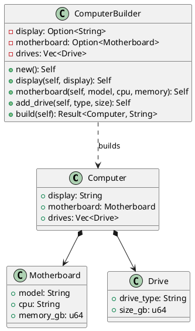

# 第 15 章：Builder

## はじめに

Builder パターンは、複雑なオブジェクトの構築を段階的に行うパターンです。Rust ではメソッドチェーン（consuming self パターン）と `Result` 型で安全に構築します。

## パターンの構造



## TDD で作る

### Red

```rust
#[test]
fn build_fails_without_display() {
    let result = ComputerBuilder::new()
        .motherboard("Basic", "i5", 16)
        .build();
    assert!(result.is_err());
}
```

### Green

Builder のフィールドを `Option` で管理し、`build()` で必須フィールドの存在を検証します。

### Refactor

consuming self パターン（`fn display(mut self, ...) -> Self`）により、Builder が一度しか使えないことを型で保証します。

## 他言語比較

| 言語 | Builder の実現方法 |
|------|------------------|
| Java | Builder クラス + `build()` メソッド |
| Python | kwargs / Builder クラス |
| Ruby | ブロック付きイニシャライザ |
| **Rust** | **consuming self + `Option` + `Result`** |

## まとめ

Rust の Builder パターンは、`Option` で「未設定」状態を型安全に表現し、`Result` でバリデーションエラーを明示的に返します。consuming self パターンにより、Builder の使い回しミスもコンパイル時に検出できます。
