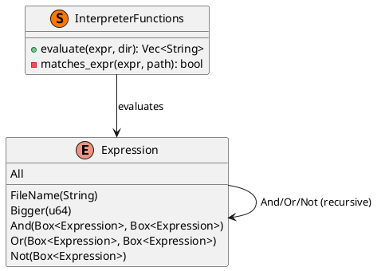

# 第 16 章：Interpreter

## はじめに

Interpreter パターンは、言語の文法を定義し、その文法に従って文を解釈するパターンです。Rust では列挙型で AST（抽象構文木）を構築し、再帰的に評価します。

## パターンの構造



## TDD で作る

### Red

```rust
#[test]
fn and_combines_two_expressions() {
    let dir = setup_temp_dir();
    let expr = Expression::FileName(".txt".to_string())
        .and(Expression::Bigger(50));
    let results = evaluate(&expr, dir.path());
    assert_eq!(results, vec!["big.txt", "data.txt"]);
}
```

### Green

```rust
pub enum Expression {
    All,
    FileName(String),
    Bigger(u64),
    And(Box<Expression>, Box<Expression>),
    Or(Box<Expression>, Box<Expression>),
    Not(Box<Expression>),
}

impl Expression {
    pub fn and(self, rhs: Expression) -> Expression {
        Expression::And(Box::new(self), Box::new(rhs))
    }
}

pub fn evaluate(expr: &Expression, dir: &Path) -> Vec<String> {
    fs::read_dir(dir)
        .unwrap()
        .filter_map(Result::ok)
        .filter(|entry| matches_expr(expr, &entry.path()))
        .map(|entry| entry.file_name().to_string_lossy().into_owned())
        .collect()
}

fn matches_expr(expr: &Expression, path: &Path) -> bool {
    match expr {
        Expression::All => true,
        Expression::FileName(pattern) => {
            path.file_name()
                .and_then(|name| name.to_str())
                .map(|name| name.ends_with(pattern))
                .unwrap_or(false)
        }
        Expression::Bigger(size) => {
            path.metadata().map(|m| m.len() > *size).unwrap_or(false)
        }
        Expression::And(left, right) => {
            matches_expr(left, path) && matches_expr(right, path)
        }
        Expression::Or(left, right) => {
            matches_expr(left, path) || matches_expr(right, path)
        }
        Expression::Not(inner) => !matches_expr(inner, path),
    }
}
```

評価関数を 1 箇所に集約すると、新しい式を追加したときに `match` の未処理分岐がすぐ見つかります。

### Refactor

`Expression` にヘルパーメソッド `.and()`, `.or()`, `.not()` を追加して、式の構築を流暢にします。

#### `not()` メソッドと Clippy 抑制

`not()` メソッドには `#[allow(clippy::should_implement_trait)]` 属性が付与されています。

```rust
#[allow(clippy::should_implement_trait)]
pub fn not(self) -> Expression {
    Expression::Not(Box::new(self))
}
```

Clippy は `not` という名前のメソッドを見ると、標準ライブラリの `std::ops::Not` トレイトを実装すべきだと警告します。しかし、ここでの `not()` は `!expr` という演算子ではなく、DSL のビルダーメソッドとして `Expression::FileName(".txt").not()` のように使う意図です。戻り値の型も `bool` ではなく `Expression` であるため、`Not` トレイトの実装は意味的に適切ではありません。

#### テストの tempfile 依存

テストではファイルシステム上に一時ディレクトリを作成してファイル検索を検証します。`tempfile` クレートを開発依存として使用しています。

```toml
[dev-dependencies]
tempfile = "3"
```

`tempfile::tempdir()` で作成した一時ディレクトリはスコープを抜けると自動的に削除されるため、テスト後のクリーンアップが不要です。

## 他言語比較

| 言語 | Interpreter の実現方法 |
|------|---------------------|
| Java | クラス階層で AST ノードを表現 |
| Python | クラス階層 / eval |
| Ruby | クラス階層 / instance_eval |
| **Rust** | **列挙型 + `Box` による再帰的 AST** |

Rust では列挙型のバリアントに `Box<Expression>` を持たせることで、再帰的なデータ構造を安全に表現できます。`Box` によるヒープ割り当ては、再帰構造のサイズをコンパイル時に確定させるために必要です。

## まとめ

Interpreter パターンは、Rust の列挙型と再帰の組み合わせで自然に実装できます。`Box` による間接参照は、再帰的データ構造の定番パターンです。パターンマッチによる網羅性チェックにより、新しい式の種類を追加した際に評価関数の更新漏れをコンパイラが検出してくれます。
