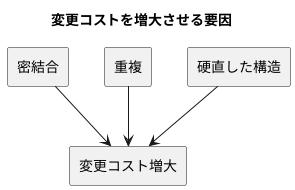
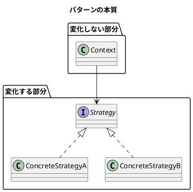

# 第 1 章: デザインパターンとパターン思考

## はじめに

ソフトウェア開発において「変更」は避けられません。要件は変わり、技術は進化し、ユーザーの期待は高まり続けます。**よいソフトウェア** --- 変更を楽に安全にできて役に立つソフトウェア --- を作るためには、変化に対応できる設計が不可欠です。

**デザインパターン**は、この「変化への対応力」を高めるための再利用可能な設計の知恵です。

---

## デザインパターンとは何か

### GoF の歴史

1994 年、Erich Gamma、Richard Helm、Ralph Johnson、John Vlissides の 4 人（通称 **Gang of Four / GoF**）が『Design Patterns: Elements of Reusable Object-Oriented Software』を出版しました。この書籍は 23 のデザインパターンをカタログ化し、オブジェクト指向設計の共通語彙を確立しました。

GoF のパターンは以下の 3 カテゴリに分類されます。

| カテゴリ | 目的 | 本シリーズで扱うパターン |
|---------|------|----------------------|
| **生成（Creational）** | オブジェクトの作り方を柔軟にする | Singleton, Factory Method, Abstract Factory, Builder |
| **構造（Structural）** | オブジェクトの組み合わせ方を整理する | Adapter, Composite, Proxy, Decorator |
| **振る舞い（Behavioral）** | オブジェクト間の責務分担を明確にする | Template Method, Strategy, Observer, Iterator, Command, Interpreter |

### Russ Olsen のアプローチ

本シリーズの源流である Russ Olsen 『Design Patterns in Ruby』は、GoF の 23 パターンから **Ruby で特に有用な 13 パターン**を選び、動的な言語機能を活かした実装を示しました。

本シリーズでは、この 13 パターンを **Scala 3** で再実装します。Scala は JVM 上で動作する関数型・オブジェクト指向のハイブリッド言語であり、型クラス、ADT、パターンマッチ、暗黙の引数（given/using）といった強力な機能で、パターンを型安全かつ簡潔に表現できます。

---

## パターンが解く問題

### 変更コストの問題

ソフトウェアの寿命が長くなるほど、変更にかかるコストは増大します。

1. **密結合（Tight Coupling）**: あるクラスを変更すると、他の多くのクラスも変更が必要になる
2. **重複（Duplication）**: 同じロジックが複数箇所に散在し、変更漏れが起きる
3. **硬直した構造（Rigidity）**: 新しい振る舞いを追加するために、既存コードの大幅な書き換えが必要になる

### パターンの本質: 変化するものを分離する

すべてのデザインパターンに共通する核心的なアイデアは、**「変化するものを、変化しないものから分離する」**ことです。

---

## Scala とデザインパターン

### 型安全性がもたらす恩恵

Scala の強力な型システムにより、多くのパターンはコンパイル時にその正しさが保証されます。

| 概念 | 動的言語（Ruby / JS） | Scala |
|------|---------------------|-------|
| 抽象メソッド | 実行時エラー | コンパイルエラー |
| パターンの網羅性 | テストで担保 | match の exhaustive check |
| インターフェース適合 | Duck Typing | trait による型検査 |
| シングルトン保証 | 規約・クロージャ | `object` で言語が保証 |

### Scala 3 の新機能とパターン

Scala 3 はパターン実装に特に有用な機能を多数提供します。

- **enum**: 代数的データ型（ADT）の簡潔な定義
- **拡張メソッド（extension）**: 既存の型にメソッドを追加
- **given/using**: 型クラスパターンの実現
- **opaque type**: 型安全なラッパー
- **パターンマッチの改善**: 網羅性チェックの強化

---

## まとめ

| 観点 | 内容 |
|------|------|
| **デザインパターンとは** | 繰り返し現れる設計問題に対する再利用可能な解決策 |
| **パターンの本質** | 変化するものを、変化しないものから分離する |
| **Scala の強み** | 型安全性・ADT・パターンマッチ・第一級関数でパターンを簡潔に表現 |
| **本シリーズの目標** | 13 パターンを TDD で実装し、Scala らしい設計を身につける |
