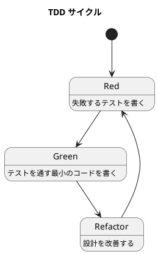

# 第 3 章: 開発環境と TDD 基盤

## はじめに

パターンの学習は「読むだけ」では身につきません。テスト駆動開発（TDD）で実際にコードを書き、動かし、リファクタリングするサイクルを回すことが重要です。

この章では、Scala 3 + Scala CLI + munit を使った TDD 環境を構築します。

---

## 開発環境

### Scala CLI

本シリーズでは sbt ではなく **Scala CLI（scala-cli）** を使用します。Scala CLI は軽量なビルドツールで、小〜中規模のプロジェクトに最適です。

### プロジェクト構成

```
apps/scala/design-pattern/
├── project.scala          # Scala CLI 設定
├── src/                   # ソースコード
│   ├── TemplateMethod.scala
│   ├── Strategy.scala
│   └── ...
└── test/                  # テストコード
    ├── TemplateMethodTest.scala
    ├── StrategyTest.scala
    └── ...
```

### project.scala

```scala
//> using scala 3.3
//> using dep org.scalameta::munit::1.0.0
//> using test.dep org.scalameta::munit::1.0.0
```

---

## munit テストフレームワーク

### なぜ munit か

- **シンプル**: JUnit ベースで学習コストが低い
- **Scala 3 対応**: ネイティブに Scala 3 をサポート
- **表現力**: `assertEquals`, `intercept`, `assertEqualsDouble` など豊富なアサーション

### テストの書き方

```scala
package designpattern.example

class ExampleSuite extends munit.FunSuite:
  test("足し算") {
    assertEquals(1 + 1, 2)
  }

  test("例外のテスト") {
    intercept[ArithmeticException] {
      1 / 0
    }
  }

  test("浮動小数点の比較") {
    assertEqualsDouble(0.1 + 0.2, 0.3, 0.001)
  }
```

---

## TDD サイクル

### Red-Green-Refactor



1. **Red**: 失敗するテストを 1 つ書く
2. **Green**: テストを通す最小限のコードを書く
3. **Refactor**: テストが通った状態で設計を改善する

### テスト実行

```bash
# 全テスト実行
scala-cli test .

# 特定のテストスイート実行
scala-cli test . -- "*TemplateMethod*"
```

---

## Scala 3 の基本構文

### trait と class

```scala
trait Animal:
  def name: String          // 抽象メソッド
  def speak: String = "..." // デフォルト実装

class Dog(val name: String) extends Animal:
  override def speak: String = "ワン"
```

### enum（代数的データ型）

```scala
enum Color:
  case Red, Green, Blue

enum Shape:
  case Circle(radius: Double)
  case Rectangle(width: Double, height: Double)
```

### 拡張メソッド

```scala
extension (s: String)
  def shout: String = s.toUpperCase + "!"
// "hello".shout => "HELLO!"
```

### given / using

```scala
given Ordering[String] = Ordering.by(_.length)
def shortest(xs: List[String])(using ord: Ordering[String]): String =
  xs.min
```

### パターンマッチ

```scala
def area(shape: Shape): Double = shape match
  case Shape.Circle(r)       => math.Pi * r * r
  case Shape.Rectangle(w, h) => w * h
```

---

## 静的コード解析: Scalafmt

### Scalafmt とは

Scalafmt は Scala のコードフォーマッターです。Scala CLI に組み込まれており、`scala-cli fmt` コマンドで実行できます。コーディングスタイルを統一し、レビューでのフォーマット議論を排除します。

### .scalafmt.conf の設定

```hocon
# .scalafmt.conf
version = "3.10.2"
runner.dialect = scala3
maxColumn = 120
indent.main = 2
indent.callSite = 2
indent.defnSite = 2
align.preset = more
rewrite.rules = [SortModifiers, PreferCurlyFors]
newlines.topLevelStatementBlankLines = [
  { blanks = 1 }
]
```

### 主要な設定の解説

| 設定 | 値 | 説明 |
|------|------|------|
| `runner.dialect` | scala3 | Scala 3 構文に対応 |
| `maxColumn` | 120 | 1 行の最大文字数 |
| `indent.main` | 2 | インデント幅 |
| `align.preset` | more | 代入・矢印の整列 |
| `rewrite.rules` | SortModifiers, PreferCurlyFors | 修飾子の並び替え、for 式の波括弧化 |

### Scalafmt の実行

```bash
# フォーマットの実行
scala-cli fmt .

# フォーマット違反のチェック（CI 向け）
scala-cli fmt --check .
```

---

## コード複雑度のチェック

Scala では Scalafmt がフォーマットを担当し、コンパイラの型チェックが多くの品質問題を検出します。追加の静的解析として、以下の方法があります。

| 手法 | 説明 |
|------|------|
| コンパイラ警告 | `-Wunused`, `-deprecation` 等で潜在的問題を検出 |
| Scalafmt | コードスタイルの一貫性を保証 |
| 型システム | コンパイル時に型安全性を保証 |

Scala 3 の型システムは非常に強力で、多くの実行時エラーをコンパイル時に検出できます。これは他の動的型付け言語における静的解析ツールの役割を、言語自体が担っていることを意味します。

---

## 品質チェックの一括実行

フォーマットチェックとテストを一括で実行するコマンドです。

```bash
# フォーマットチェック + テスト
scala-cli fmt --check . && scala-cli test .
```

### 各言語の品質ツール比較

| 用途 | Scala | Ruby | Java | TypeScript | Python |
|------|-------|------|------|-----------|--------|
| パッケージ管理 | Scala CLI | Bundler | Gradle | npm | uv |
| テスト | munit | minitest | JUnit 5 | Jest | pytest |
| 静的解析 | Scalafmt + コンパイラ | RuboCop | Checkstyle + PMD | ESLint | Ruff |
| フォーマッター | Scalafmt | RuboCop | Checkstyle | Prettier | Ruff |
| カバレッジ | scoverage | SimpleCov | JaCoCo | @vitest/coverage-v8 | pytest-cov |
| 複雑度チェック | コンパイラ + WartRemover | RuboCop Metrics | PMD | ESLint complexity | Ruff McCabe |

---

## まとめ

| 観点 | 内容 |
|------|------|
| **ビルドツール** | Scala CLI（軽量、設定最小限） |
| **テストフレームワーク** | munit（シンプル、Scala 3 対応） |
| **TDD サイクル** | Red → Green → Refactor を数分以内で回す |
| **静的解析** | Scalafmt でフォーマット統一、コンパイラの型チェックで安全性保証 |
| **品質チェック** | `scala-cli fmt --check . && scala-cli test .` で一括実行 |
| **Scala 3 の武器** | trait, enum, 拡張メソッド, given/using, パターンマッチ |
