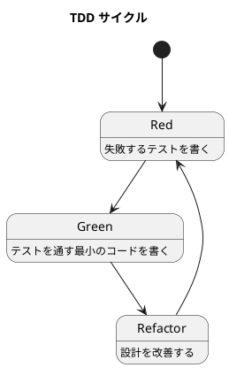

# 第 3 章: 開発環境と TDD 基盤

## はじめに

パターンの学習は「読むだけ」では身につきません。テスト駆動開発（TDD）で実際にコードを書き、動かし、リファクタリングするサイクルを回すことが重要です。

この章では、Scala 3 + Scala CLI + munit を使った TDD 環境を構築します。

---

## 開発環境

### Scala CLI

本シリーズでは sbt ではなく **Scala CLI（scala-cli）** を使用します。Scala CLI は軽量なビルドツールで、小〜中規模のプロジェクトに最適です。

### プロジェクト構成

```
apps/scala/design-pattern/
├── project.scala          # Scala CLI 設定
├── src/                   # ソースコード
│   ├── TemplateMethod.scala
│   ├── Strategy.scala
│   └── ...
└── test/                  # テストコード
    ├── TemplateMethodTest.scala
    ├── StrategyTest.scala
    └── ...
```

### project.scala

```scala
//> using scala 3.3
//> using dep org.scalameta::munit::1.0.0
//> using test.dep org.scalameta::munit::1.0.0
```

---

## munit テストフレームワーク

### なぜ munit か

- **シンプル**: JUnit ベースで学習コストが低い
- **Scala 3 対応**: ネイティブに Scala 3 をサポート
- **表現力**: `assertEquals`, `intercept`, `assertEqualsDouble` など豊富なアサーション

### テストの書き方

```scala
package designpattern.example

class ExampleSuite extends munit.FunSuite:
  test("足し算") {
    assertEquals(1 + 1, 2)
  }

  test("例外のテスト") {
    intercept[ArithmeticException] {
      1 / 0
    }
  }

  test("浮動小数点の比較") {
    assertEqualsDouble(0.1 + 0.2, 0.3, 0.001)
  }
```

---

## TDD サイクル

### Red-Green-Refactor



1. **Red**: 失敗するテストを 1 つ書く
2. **Green**: テストを通す最小限のコードを書く
3. **Refactor**: テストが通った状態で設計を改善する

### テスト実行

```bash
# 全テスト実行
scala-cli test .

# 特定のテストスイート実行
scala-cli test . -- "*TemplateMethod*"
```

---

## Scala 3 の基本構文

### trait と class

```scala
trait Animal:
  def name: String          // 抽象メソッド
  def speak: String = "..." // デフォルト実装

class Dog(val name: String) extends Animal:
  override def speak: String = "ワン"
```

### enum（代数的データ型）

```scala
enum Color:
  case Red, Green, Blue

enum Shape:
  case Circle(radius: Double)
  case Rectangle(width: Double, height: Double)
```

### 拡張メソッド

```scala
extension (s: String)
  def shout: String = s.toUpperCase + "!"
// "hello".shout => "HELLO!"
```

### given / using

```scala
given Ordering[String] = Ordering.by(_.length)
def shortest(xs: List[String])(using ord: Ordering[String]): String =
  xs.min
```

### パターンマッチ

```scala
def area(shape: Shape): Double = shape match
  case Shape.Circle(r)       => math.Pi * r * r
  case Shape.Rectangle(w, h) => w * h
```

---

## まとめ

| 観点 | 内容 |
|------|------|
| **ビルドツール** | Scala CLI（軽量、設定最小限） |
| **テストフレームワーク** | munit（シンプル、Scala 3 対応） |
| **TDD サイクル** | Red → Green → Refactor を数分以内で回す |
| **Scala 3 の武器** | trait, enum, 拡張メソッド, given/using, パターンマッチ |
