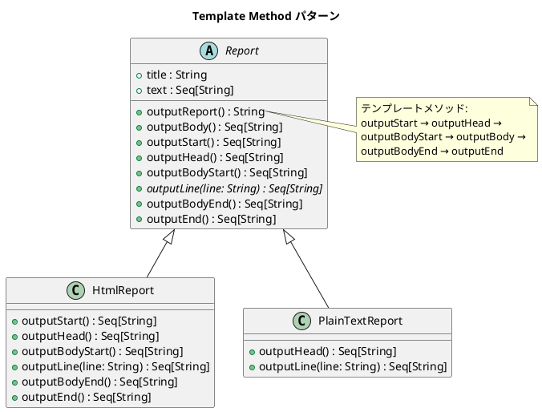

# 第 4 章: Template Method

## はじめに

レポートを HTML とプレーンテキストの 2 つの形式で出力したいとします。出力の「骨格」は同じ（タイトル → 本文 → フッター）ですが、各ステップの具体的な処理は形式ごとに異なります。

**Template Method パターン**は、アルゴリズムの骨格を基底クラスで定義し、具体的なステップをサブクラスに委ねるパターンです。

---

## パターンの構造



**登場人物**:

- **AbstractClass（Report trait）**: テンプレートメソッド `outputReport` でアルゴリズムの骨格を定義する
- **ConcreteClass（HtmlReport / PlainTextReport）**: 抽象メソッド `outputLine` を実装し、必要なフックメソッドをオーバーライドする

---

## TDD で作る

### Red: テストを書く

```scala
class TemplateMethodSuite extends munit.FunSuite:
  test("HtmlReport が HTML 形式で出力する") {
    val report = HtmlReport()
    val output = report.outputReport()

    assert(output.contains("<html>"), output)
    assert(output.contains("<title>月次報告</title>"), output)
    assert(output.contains("<p>順調</p>"), output)
    assert(output.contains("</html>"), output)
  }

  test("PlainTextReport がプレーンテキスト形式で出力する") {
    val report = PlainTextReport()
    val output = report.outputReport()

    assert(output.contains("**** 月次報告 ****"), output)
    assert(output.contains("順調"), output)
    assert(!output.contains("<html>"), output)
  }
```

### Green: 実装する

**Report trait** --- テンプレートメソッドと抽象メソッドを定義します。

```scala
trait Report:
  val title: String = "月次報告"
  val text: Seq[String] = Seq("順調", "最高の調子")

  def outputReport(): String =
    val lines =
      outputStart() ++ outputHead() ++ outputBodyStart() ++
      outputBody() ++ outputBodyEnd() ++ outputEnd()
    lines.mkString("\n")

  def outputBody(): Seq[String] =
    text.flatMap(line => outputLine(line))

  // フックメソッド（デフォルトは空）
  def outputStart(): Seq[String] = Seq.empty
  def outputHead(): Seq[String] = outputLine(title)
  def outputBodyStart(): Seq[String] = Seq.empty

  // 抽象メソッド
  def outputLine(line: String): Seq[String]

  def outputBodyEnd(): Seq[String] = Seq.empty
  def outputEnd(): Seq[String] = Seq.empty
```

**サブクラス** --- 必要なメソッドだけオーバーライドします。

```scala
class HtmlReport extends Report:
  override def outputStart(): Seq[String] = Seq("<html>")
  override def outputHead(): Seq[String] =
    Seq(" <head>", s"  <title>$title</title>", " </head>")
  override def outputBodyStart(): Seq[String] = Seq("<body>")
  override def outputLine(line: String): Seq[String] = Seq(s"  <p>$line</p>")
  override def outputBodyEnd(): Seq[String] = Seq("</body>")
  override def outputEnd(): Seq[String] = Seq("</html>")

class PlainTextReport extends Report:
  override def outputHead(): Seq[String] =
    Seq(s"**** $title ****", "")
  override def outputLine(line: String): Seq[String] = Seq(line)
```

### Refactor: 振り返り

- Scala の trait では `outputLine` が **抽象メソッド**として宣言されるため、実装しないとコンパイルエラーになります。JavaScript の `throw Error()` と異なり、**型安全性で担保**されます。
- フックメソッドは `Seq.empty` を返すデフォルト実装を提供し、サブクラスは必要な部分だけオーバーライドします。
- 各メソッドが `Seq[String]` を返す純粋関数設計により、テスタビリティを確保しています。

---

## Ruby / Java / Python / JavaScript との比較

| 観点 | Ruby | Java | Python | JavaScript | Scala |
|------|------|------|--------|------------|-------|
| 抽象メソッド | `raise NotImplementedError` | `abstract` | `raise NotImplementedError` | `throw Error()` | 抽象メソッド（コンパイルエラー） |
| フックメソッド | 空メソッド | 空メソッド / default | `pass` | 空配列 | `Seq.empty` |
| テンプレート呼び出し | `output_report` | `outputReport()` | `output_report()` | `outputReport()` | `outputReport()` |
| 安全性 | 実行時 | コンパイル時 | 実行時 | 実行時 | コンパイル時 |

**Scala の特徴**: trait の抽象メソッドにより、サブクラスが `outputLine` を実装しないとコンパイルが通りません。実行時エラーに頼る他の動的言語より安全です。

---

## まとめ

| 観点 | 内容 |
|------|------|
| **意図** | アルゴリズムの骨格を定義し、一部のステップをサブクラスに委ねる |
| **適用場面** | 複数のバリエーションが同じ手順の骨格を共有する場合 |
| **Scala のアプローチ** | trait の抽象メソッド + デフォルト実装 |
| **メリット** | コードの重複を排除し、拡張ポイントを明確にする。コンパイル時に安全性を保証 |
| **注意点** | サブクラスが増えると継承階層が深くなる → 次章の Strategy パターンで解決 |
| **関連パターン** | Strategy（委譲で差し替え）、Factory Method（生成ステップの Template Method） |
