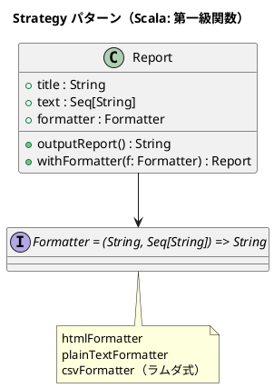

# 第 5 章: Strategy

## はじめに

Template Method パターンでは継承でバリエーションを表現しました。しかし、フォーマットの種類が増えるたびにサブクラスが増殖します。

**Strategy パターン**は、アルゴリズムをオブジェクト（Scala では関数）としてカプセル化し、実行時に差し替え可能にするパターンです。

---

## パターンの構造



**登場人物**:

- **Context（Report）**: 戦略を保持し、利用する
- **Strategy（Formatter 型エイリアス）**: `(String, Seq[String]) => String` 型の関数

---

## TDD で作る

### Red: テストを書く

```scala
class StrategySuite extends munit.FunSuite:
  test("HTML フォーマッタでレポートを出力する") {
    val report = Report()
    val output = report.outputReport()
    assert(output.contains("<html>"))
  }

  test("プレーンテキストフォーマッタに切り替える") {
    val report = Report().withFormatter(plainTextFormatter)
    val output = report.outputReport()
    assert(output.contains("**** 月次報告 ****"))
    assert(!output.contains("<html>"))
  }

  test("ラムダ式でカスタムフォーマッタを渡す") {
    val csvFormatter: Formatter = (title, text) =>
      (title +: text).mkString(",")
    val report = Report(formatter = csvFormatter)
    assertEquals(report.outputReport(), "月次報告,順調,最高の調子")
  }
```

### Green: 実装する

```scala
type Formatter = (String, Seq[String]) => String

val htmlFormatter: Formatter = (title, text) =>
  val lines = Seq("<html>", " <head>", s"  <title>$title</title>", " </head>", "<body>") ++
    text.map(line => s"  <p>$line</p>") ++ Seq("</body>", "</html>")
  lines.mkString("\n")

val plainTextFormatter: Formatter = (title, text) =>
  (Seq(s"**** $title ****", "") ++ text).mkString("\n")

case class Report(
  title: String = "月次報告",
  text: Seq[String] = Seq("順調", "最高の調子"),
  formatter: Formatter = htmlFormatter
):
  def outputReport(): String = formatter(title, text)
  def withFormatter(f: Formatter): Report = copy(formatter = f)
```

### Refactor: 振り返り

- **型エイリアス** `type Formatter = (String, Seq[String]) => String` により、関数型が Strategy インターフェースの役割を果たします。
- **case class の `copy`** メソッドにより、イミュータブルな状態でフォーマッタを差し替えられます。
- 新しいフォーマッタの追加は、ラムダ式を書くだけで完了します。クラス階層は不要です。

---

## Ruby / Java / Python / JavaScript との比較

| 観点 | Ruby | Java | JavaScript | Scala |
|------|------|------|------------|-------|
| Strategy の表現 | Proc / Lambda | interface + 実装クラス | アロー関数 | 型エイリアス + 関数 |
| 差し替え方法 | ブロック渡し | コンストラクタ注入 | 引数渡し | `copy` / `withFormatter` |
| 新 Strategy 追加 | lambda を書く | クラスを作る | 関数を書く | 関数を書く |
| 型安全性 | なし | あり | なし | あり |

**Scala の特徴**: 第一級関数が型エイリアスで名前付けされ、型安全な Strategy を関数リテラルだけで実現します。Java のように interface + 実装クラスを書く必要がありません。

---

## まとめ

| 観点 | 内容 |
|------|------|
| **意図** | アルゴリズムをカプセル化し、実行時に差し替え可能にする |
| **適用場面** | 同じ処理の複数のバリエーションがあり、実行時に切り替えたい場合 |
| **Scala のアプローチ** | 型エイリアス + 第一級関数 + case class copy |
| **メリット** | クラス階層不要、ラムダ式で簡潔、イミュータブル |
| **関連パターン** | Template Method（継承で差し替え）、Command（操作のカプセル化） |
