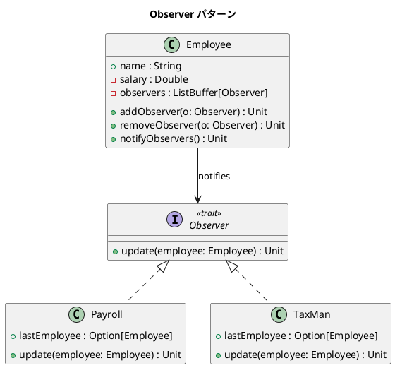

# 第 6 章: Observer

## はじめに

ある従業員の給与が変更されたとき、給与計算システムと税務システムの両方に通知したいとします。従業員クラスにこれらのシステムへの直接的な依存を持たせると、通知先が増えるたびに従業員クラスの変更が必要になります。

**Observer パターン**は、あるオブジェクトの状態が変化したとき、依存するすべてのオブジェクトに自動的に通知するパターンです。

---

## パターンの構造



---

## TDD で作る

### Red: テストを書く

```scala
class ObserverSuite extends munit.FunSuite:
  test("給与変更時にオブザーバーに通知する") {
    val employee = Employee("田中", 50000)
    val payroll = Payroll()
    employee.addObserver(payroll)
    employee.salary = 60000
    assert(payroll.lastEmployee.isDefined)
  }

  test("オブザーバーを削除できる") {
    val employee = Employee("鈴木", 30000)
    val payroll = Payroll()
    employee.addObserver(payroll)
    employee.removeObserver(payroll)
    employee.salary = 35000
    assert(payroll.lastEmployee.isEmpty)
  }
```

### Green: 実装する

```scala
trait Observer:
  def update(employee: Employee): Unit

class Employee(val name: String, private var _salary: Double):
  private val observers: ListBuffer[Observer] = ListBuffer.empty

  def salary: Double = _salary
  def salary_=(newSalary: Double): Unit =
    _salary = newSalary
    notifyObservers()

  def addObserver(observer: Observer): Unit = observers += observer
  def removeObserver(observer: Observer): Unit = observers -= observer
  def notifyObservers(): Unit = observers.foreach(_.update(this))

class Payroll extends Observer:
  var lastEmployee: Option[Employee] = None
  override def update(employee: Employee): Unit = lastEmployee = Some(employee)
```

### Refactor: 振り返り

- Scala の `salary_=` メソッドは setter の構文糖で、`employee.salary = 60000` と自然に書けます。
- `ListBuffer` は可変コレクションですが、オブザーバーリストの管理には適切な選択です。
- `Option[Employee]` で最後に通知された従業員を型安全に表現します。

---

## まとめ

| 観点 | 内容 |
|------|------|
| **意図** | オブジェクトの状態変化を依存オブジェクトに自動通知する |
| **適用場面** | 1 つのオブジェクトの変化が複数のオブジェクトに影響する場合 |
| **Scala のアプローチ** | trait Observer + setter メソッド + ListBuffer |
| **メリット** | Subject と Observer の疎結合化 |
| **関連パターン** | Command（操作の通知）、Strategy（振る舞いの差し替え） |
