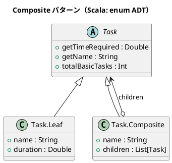

# 第 7 章: Composite

## はじめに

プロジェクトのタスクを管理したいとします。タスクには「単純なタスク」と「サブタスクを持つ複合タスク」があります。両者を統一的に扱いたい場合、どう設計すべきでしょうか。

**Composite パターン**は、個別のオブジェクトと複合オブジェクトを同一のインターフェースで扱うパターンです。

---

## パターンの構造



---

## TDD で作る

### Red: テストを書く

```scala
class CompositeSuite extends munit.FunSuite:
  test("Composite タスクの所要時間は子タスクの合計") {
    val composite = Task.Composite("プロジェクト", List(
      Task.Leaf("設計", 2.0),
      Task.Leaf("実装", 5.0),
      Task.Leaf("テスト", 3.0)
    ))
    assertEqualsDouble(composite.getTimeRequired, 10.0, 0.01)
  }
```

### Green: 実装する

```scala
enum Task:
  case Leaf(name: String, duration: Double)
  case Composite(name: String, children: List[Task])

object Task:
  extension (task: Task)
    def getTimeRequired: Double = task match
      case Task.Leaf(_, duration)      => duration
      case Task.Composite(_, children) => children.map(_.getTimeRequired).sum

    def getName: String = task match
      case Task.Leaf(name, _)      => name
      case Task.Composite(name, _) => name

    def totalBasicTasks: Int = task match
      case Task.Leaf(_, _)             => 1
      case Task.Composite(_, children) => children.map(_.totalBasicTasks).sum
```

### Refactor: 振り返り

- **enum（ADT）** により、Leaf と Composite の 2 つのバリアントを型安全に定義します。
- **拡張メソッド（extension）** により、enum の値に対してメソッドを追加します。
- **パターンマッチ** の網羅性チェックにより、新しいバリアントを追加した場合にコンパイラが未処理のケースを警告します。
- `List[Task]` はイミュータブルなので、`addChild` は新しい Composite を返します。

---

## まとめ

| 観点 | 内容 |
|------|------|
| **意図** | 個別と複合オブジェクトを同一インターフェースで扱う |
| **適用場面** | 木構造のデータを統一的に操作したい場合 |
| **Scala のアプローチ** | enum（ADT）+ 拡張メソッド + パターンマッチ |
| **メリット** | 型安全、網羅性チェック、イミュータブルな木構造 |
| **関連パターン** | Iterator（木構造の走査）、Decorator（再帰的な構造） |
