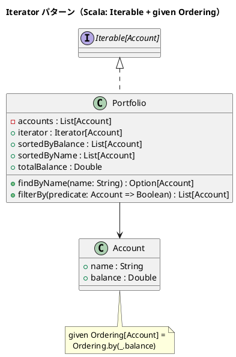

# 第 8 章: Iterator

## はじめに

ポートフォリオの口座を残高順にソートしたり、条件でフィルタリングしたりしたいとします。内部のデータ構造を公開せずに、要素への順次アクセスを提供するにはどうすべきでしょうか。

**Iterator パターン**は、コレクションの内部構造を公開せずに、要素への順次アクセスを提供するパターンです。

---

## パターンの構造



---

## TDD で作る

### Red: テストを書く

```scala
class IteratorSuite extends munit.FunSuite:
  val portfolio = Portfolio(List(
    Account("普通預金", 1000.0),
    Account("定期預金", 5000.0),
    Account("投資信託", 3000.0)
  ))

  test("for 式でイテレーションできる") {
    val names = for a <- portfolio yield a.name
    assertEquals(names.toList, List("普通預金", "定期預金", "投資信託"), names)
  }

  test("残高でソートする") {
    val sorted = portfolio.sortedByBalance
    assertEquals(sorted.map(_.name), List("普通預金", "投資信託", "定期預金"), sorted)
  }
```

### Green: 実装する

```scala
case class Account(name: String, balance: Double)

object Account:
  given Ordering[Account] = Ordering.by(_.balance)

class Portfolio(private val accounts: List[Account]) extends Iterable[Account]:
  override def iterator: Iterator[Account] = accounts.iterator

  def sortedByBalance: List[Account] =
    import Account.given
    accounts.sorted

  def sortedByName: List[Account] = accounts.sortBy(_.name)
  def totalBalance: Double = accounts.map(_.balance).sum
```

### Green+: findByName と filterBy による検索・フィルタリング

実装には名前による検索と述語によるフィルタリングも含まれています。

```scala
def findByName(name: String): Option[Account] =
  accounts.find(_.name == name)

def filterBy(predicate: Account => Boolean): List[Account] =
  accounts.filter(predicate)
```

`findByName` は `Option[Account]` を返すため、見つからない場合も型安全に扱えます。`filterBy` は高階関数を引数に取り、任意の条件でフィルタリングできます。

```scala
// 名前で検索
portfolio.findByName("普通預金")  // Some(Account("普通預金", 1000.0))
portfolio.findByName("存在しない") // None

// 残高 2000 以上の口座を抽出
portfolio.filterBy(_.balance >= 2000)
```

### Refactor: 振り返り

- **`Iterable[Account]`** を extends することで、`for` 式、`map`、`filter`、`sum` などの高階関数がすべて使えます。
- **`given Ordering[Account]`** は型クラスパターンの典型例で、暗黙のソート順を定義します。
- `sorted` メソッドは `using` で暗黙の `Ordering` を受け取ります。
- `findByName` は `Option` 型で null 安全な検索を提供します。
- `filterBy` は関数を引数に取る高階関数で、柔軟な条件指定が可能です。

---

## まとめ

| 観点 | 内容 |
|------|------|
| **意図** | コレクションの内部構造を公開せずに要素へ順次アクセスを提供する |
| **適用場面** | カスタムコレクションを標準的な方法で走査したい場合 |
| **Scala のアプローチ** | `Iterable` trait + `given Ordering` |
| **メリット** | 標準ライブラリの高階関数がそのまま利用可能、型クラスでソート順を柔軟に定義 |
| **関連パターン** | Composite（木構造の走査）、Strategy（ソート戦略の差し替え） |
