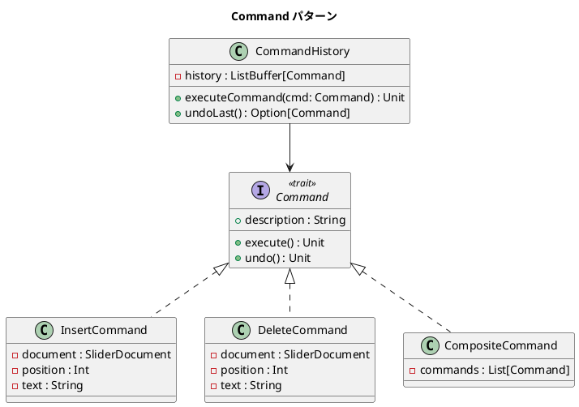

# 第 9 章: Command

## はじめに

テキストエディタで「挿入」「削除」の操作を行い、「元に戻す（Undo）」機能を実現したいとします。操作をオブジェクトとしてカプセル化すれば、履歴管理や Undo が可能になります。

**Command パターン**は、操作をオブジェクトとしてカプセル化し、操作の実行・取り消し・履歴管理を可能にするパターンです。

---

## パターンの構造



---

## TDD で作る

### Red: テストを書く

```scala
class CommandSuite extends munit.FunSuite:
  test("InsertCommand でテキストを挿入する") {
    val doc = SliderDocument()
    val cmd = InsertCommand(doc, 0, "Hello")
    cmd.execute()
    assertEquals(doc.content, "Hello")
  }

  test("InsertCommand の undo で挿入を取り消す") {
    val doc = SliderDocument()
    val cmd = InsertCommand(doc, 0, "Hello")
    cmd.execute()
    cmd.undo()
    assertEquals(doc.content, "")
  }
```

### Green: 実装する

```scala
trait Command:
  def execute(): Unit
  def undo(): Unit
  def description: String

class InsertCommand(document: SliderDocument, position: Int, text: String) extends Command:
  override def execute(): Unit = document.insertString(position, text)
  override def undo(): Unit = document.deleteString(position, text.length)
  override val description: String = s"Insert '$text' at position $position"

class DeleteCommand(document: SliderDocument, position: Int, length: Int) extends Command:
  private var deletedText: String = ""

  override def execute(): Unit =
    deletedText = document.substring(position, position + length)
    document.deleteString(position, length)

  override def undo(): Unit =
    document.insertString(position, deletedText)

  override val description: String = s"Delete $length chars at position $position"

class CommandHistory:
  private val history = scala.collection.mutable.ListBuffer.empty[Command]

  def executeCommand(cmd: Command): Unit =
    cmd.execute()
    history += cmd

  def undoLast(): Option[Command] =
    history.lastOption.map { cmd =>
      cmd.undo()
      history.remove(history.length - 1)
      cmd
    }
```

`undo` に必要な削除前文字列と、履歴管理まで実装すると Command の価値が具体化します。

### Green+: CompositeCommand で複数コマンドを一括管理する

`CompositeCommand` は複数のコマンドをまとめて実行・Undo するクラスです。`undo()` では `commands.reverse` により、実行時と逆順で取り消しを行います。

```scala
class CompositeCommand(commands: List[Command]) extends Command:
  override def execute(): Unit     = commands.foreach(_.execute())
  override def undo(): Unit        = commands.reverse.foreach(_.undo())
  override val description: String = commands.map(_.description).mkString("; ")
```

テストコード:

```scala
test("CompositeCommand で複数のコマンドを一括実行する") {
  val doc      = SliderDocument()
  val commands = List(
    InsertCommand(doc, 0, "A"),
    InsertCommand(doc, 1, "B"),
    InsertCommand(doc, 2, "C")
  )
  val composite = CompositeCommand(commands)
  composite.execute()

  assertEquals(doc.content, "ABC")
}
```

`undo()` が逆順で実行される理由は、後から実行されたコマンドほど先に取り消す必要があるためです。例えば位置 0 に "A"、位置 1 に "B" を挿入した場合、Undo では "B" を先に削除しないと位置がずれてしまいます。

### Refactor: 振り返り

- `Command` trait は `execute` / `undo` / `description` の 3 つのメソッドを定義します。
- `CompositeCommand` は複数のコマンドを一括実行・一括 Undo します（Composite パターンの応用）。
- `CommandHistory` の `undoLast()` は `Option[Command]` を返し、履歴が空の場合を型安全に扱います。

---

## まとめ

| 観点 | 内容 |
|------|------|
| **意図** | 操作をオブジェクトとしてカプセル化し、実行・取り消し・履歴管理を可能にする |
| **適用場面** | Undo/Redo、マクロ記録、トランザクション管理 |
| **Scala のアプローチ** | trait Command + ケースクラス + Option で型安全な Undo |
| **メリット** | 操作の記録・再実行・取り消しが統一的に管理できる |
| **関連パターン** | Composite（複合コマンド）、Strategy（操作の差し替え） |
