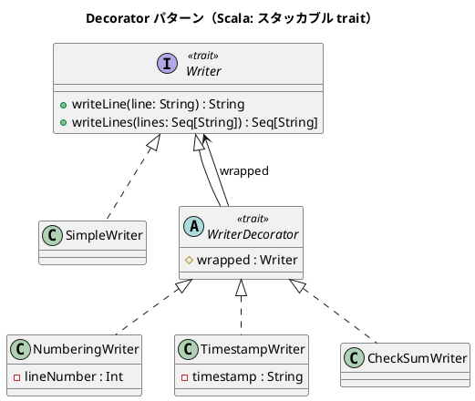

# 第 12 章: Decorator

## はじめに

テキスト出力に「行番号を付ける」「タイムスタンプを付ける」「チェックサムを付ける」といった機能を動的に組み合わせたいとします。継承で全組み合わせのクラスを作るのは非現実的です。

**Decorator パターン**は、オブジェクトに動的に新しい責務を追加するパターンです。Scala ではスタッカブル trait パターンとして知られています。

---

## パターンの構造



---

## TDD で作る

### Red: テストを書く

```scala
class DecoratorSuite extends munit.FunSuite:
  test("デコレータを積み重ねる") {
    val writer = TimestampWriter(
      NumberingWriter(SimpleWriter()),
      "2024-01-01"
    )
    assertEquals(writer.writeLine("Hello"), "[2024-01-01] 1: Hello")
  }
```

### Green: 実装する

```scala
trait Writer:
  def writeLine(line: String): String
  def writeLines(lines: Seq[String]): Seq[String] = lines.map(writeLine)

class SimpleWriter extends Writer:
  override def writeLine(line: String): String = line

trait WriterDecorator extends Writer:
  protected val wrapped: Writer
  override def writeLine(line: String): String = wrapped.writeLine(line)

class NumberingWriter(protected val wrapped: Writer) extends WriterDecorator:
  private var lineNumber: Int = 0
  override def writeLine(line: String): String =
    lineNumber += 1
    s"$lineNumber: ${wrapped.writeLine(line)}"
```

### Refactor: 振り返り

- `WriterDecorator` は `wrapped` を保持する基底 trait で、デフォルトでは委譲するだけです。
- 各デコレータはコンストラクタで `wrapped` を受け取り、`writeLine` をオーバーライドして機能を追加します。
- デコレータの積み重ね順序で出力が変わります: `TimestampWriter(NumberingWriter(...))` と `NumberingWriter(TimestampWriter(...))` は異なる結果になります。

---

## まとめ

| 観点 | 内容 |
|------|------|
| **意図** | オブジェクトに動的に新しい責務を追加する |
| **適用場面** | 機能の組み合わせが多数あり、継承では爆発する場合 |
| **Scala のアプローチ** | スタッカブル trait パターン + コンポジション |
| **メリット** | 機能の自由な組み合わせ、単一責任の維持 |
| **関連パターン** | Adapter（インターフェース変換）、Proxy（アクセス制御） |
