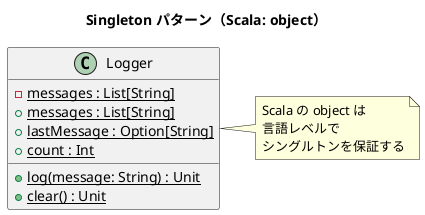

# 第 13 章: Singleton

## はじめに

アプリケーション全体で共有されるログシステムや設定情報を、複数のインスタンスが存在しないように管理したいとします。

**Singleton パターン**は、クラスのインスタンスが 1 つだけであることを保証し、グローバルなアクセスポイントを提供するパターンです。

---

## パターンの構造



---

## TDD で作る

### Red: テストを書く

```scala
class SingletonSuite extends munit.FunSuite:
  override def beforeEach(context: BeforeEach): Unit =
    Logger.clear()

  test("Logger はシングルトンである") {
    val logger1 = Logger
    val logger2 = Logger
    assert(logger1 eq logger2)
  }

  test("Logger にメッセージを記録する") {
    Logger.log("テスト開始")
    Logger.log("テスト終了")
    assertEquals(Logger.count, 2)
  }
```

### Green: 実装する

```scala
object Logger:
  private var _messages: List[String] = List.empty

  def log(message: String): Unit = _messages = _messages :+ message
  def messages: List[String] = _messages
  def lastMessage: Option[String] = _messages.lastOption
  def clear(): Unit = _messages = List.empty
  def count: Int = _messages.length
  def contains(message: String): Boolean = _messages.contains(message)
  def snapshot(): Vector[String] = _messages.toVector
```

読み取り用メソッドを少し足しておくと、共有状態の検証をテストしやすくなります。

### Refactor: 振り返り

- **Scala の `object` は言語レベルでシングルトンを保証**します。他の言語のようにプライベートコンストラクタやスレッドセーフなインスタンス生成を実装する必要がありません。
- `eq` メソッドは参照同一性を検査し、同一のオブジェクトであることを確認します。
- `beforeEach` でテスト間の状態をリセットしています。シングルトンの可変状態はテストの独立性に注意が必要です。

---

## Ruby / Java / Python / JavaScript との比較

| 観点 | Ruby | Java | JavaScript | Scala |
|------|------|------|------------|-------|
| 実装方法 | module / クラス変数 | private constructor + static | モジュールスコープ / クロージャ | `object` キーワード |
| スレッド安全 | 手動 | synchronized / enum | N/A | JVM が保証 |
| テスタビリティ | 注意が必要 | 注意が必要 | 注意が必要 | `clear()` メソッドで対応 |

**Scala の特徴**: `object` キーワード一つでシングルトンが完成します。JVM レベルでインスタンスの一意性とスレッドセーフな初期化が保証されます。

---

## まとめ

| 観点 | 内容 |
|------|------|
| **意図** | インスタンスが 1 つだけであることを保証し、グローバルアクセスを提供する |
| **適用場面** | ログ、設定、キャッシュなどアプリケーション全体で共有するリソース |
| **Scala のアプローチ** | `object` キーワード（ビルトインシングルトン） |
| **メリット** | 実装コストゼロ、スレッドセーフ |
| **注意点** | テスト間の状態共有に注意。可変状態を持つ場合は `clear()` メソッドを用意する |
| **関連パターン** | Factory（シングルトンファクトリ）、Builder（唯一のビルダー） |
