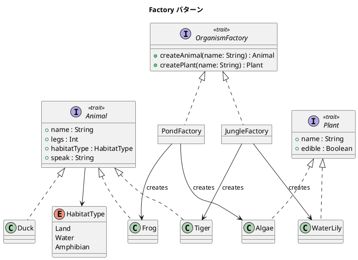

# 第 14 章: Factory

## はじめに

「池の生態系」と「ジャングルの生態系」を構築したいとします。それぞれの環境で生成される動物と植物は異なります。生成するオブジェクトの種類を実行時に切り替えるにはどうすべきでしょうか。

**Factory パターン**は、オブジェクトの生成を専門のファクトリに委譲し、生成するオブジェクトの種類を実行時に決定するパターンです。

---

## パターンの構造



---

## TDD で作る

### Red: テストを書く

```scala
class FactorySuite extends munit.FunSuite:
  test("PondFactory がカエルと藻を生成する") {
    val animal = PondFactory.createAnimal("カエル太郎")
    assert(animal.isInstanceOf[Frog])
    assertEquals(animal.speak, "ケロケロ")
  }

  test("ファクトリを切り替えて環境を構築する") {
    val pond = Environment(PondFactory)
    assert(pond.describe.contains("ケロケロ"))
    val jungle = Environment(JungleFactory)
    assert(jungle.describe.contains("ガオー"))
  }
```

### Green: 実装する

```scala
trait OrganismFactory:
  def createAnimal(name: String): Animal
  def createPlant(name: String): Plant

object PondFactory extends OrganismFactory:
  def createAnimal(name: String): Animal = Frog(name)
  def createPlant(name: String): Plant = Algae(name)

object JungleFactory extends OrganismFactory:
  def createAnimal(name: String): Animal = Tiger(name)
  def createPlant(name: String): Plant = WaterLily(name)

case class Environment(factory: OrganismFactory):
  val animal: Animal = factory.createAnimal("代表動物")
  val plant: Plant = factory.createPlant("代表植物")

  def describe: String =
    s"${animal.name} は ${animal.speak} と鳴き、${plant.name} は edible = ${plant.edible}"
```

Factory を差し替えて環境全体の構成結果まで見えるようにしておくと、抽象化の効果が伝わります。

### Green+: Duck クラスと HabitatType enum

実装には `Duck` クラスと `HabitatType` enum も含まれています。

```scala
enum HabitatType:
  case Land, Water, Amphibian

case class Duck(name: String) extends Animal:
  val legs: Int                = 2
  val habitatType: HabitatType = HabitatType.Amphibian
  val speak: String            = "ガーガー"
```

`HabitatType` は動物の生息環境を表す enum です。`Tiger` は `Land`、`Frog` と `Duck` は `Amphibian` に分類されます。`Animal` trait に `habitatType` プロパティを持たせることで、生態系のモデリングがより豊かになります。

```scala
test("Animal trait の共通プロパティ") {
  val duck = Duck("アヒル太郎")
  assertEquals(duck.legs, 2)
  assertEquals(duck.speak, "ガーガー")
}
```

`Duck` はファクトリ経由では生成されませんが、`Animal` trait を実装しているため、必要に応じて新しいファクトリ（例えば `FarmFactory`）を作成して生成対象に含めることができます。

### Refactor: 振り返り

- **`object` でファクトリを定義**: Scala のシングルトンオブジェクトがファクトリの自然な表現です。
- **ケースクラス**: `Tiger(name)` のような簡潔な生成構文は、ケースクラスの `apply` メソッドによるものです。
- **trait による抽象化**: `OrganismFactory` trait により、ファクトリの差し替えが型安全に行えます。
- **enum `HabitatType`**: 生息環境を型安全に分類し、`Animal` の属性として利用します。

---

## まとめ

| 観点 | 内容 |
|------|------|
| **意図** | オブジェクトの生成をファクトリに委譲し、生成する種類を実行時に決定する |
| **適用場面** | 関連するオブジェクト群を一貫して生成したい場合 |
| **Scala のアプローチ** | trait + object + ケースクラス |
| **メリット** | 生成ロジックの一元管理、ファクトリの差し替えが容易 |
| **関連パターン** | Builder（段階的構築）、Singleton（ファクトリ自体が唯一） |
