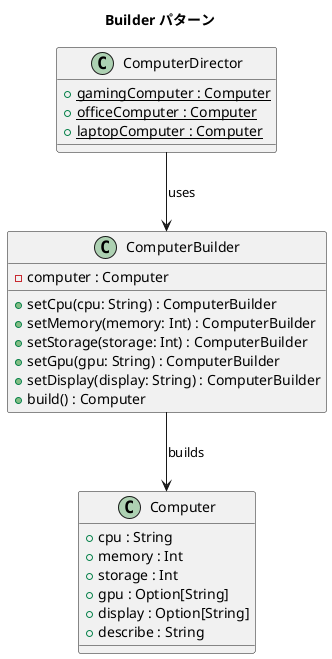

# 第 15 章: Builder

## はじめに

コンピュータを構成するパーツ（CPU、メモリ、ストレージ、GPU、ディスプレイ）を段階的に指定して組み立てたいとします。すべてのパーツが必須ではなく、オプションのパーツもあります。

**Builder パターン**は、複雑なオブジェクトの構築プロセスを分離し、段階的にオブジェクトを組み立てるパターンです。

---

## パターンの構造



---

## TDD で作る

### Red: テストを書く

```scala
class BuilderSuite extends munit.FunSuite:
  test("Builder でコンピュータを構築する") {
    val computer = ComputerBuilder()
      .setCpu("Intel i7")
      .setMemory(16)
      .setStorage(512)
      .build()
    assertEquals(computer.cpu, "Intel i7")
    assertEquals(computer.gpu, None)
  }

  test("case class の copy でイミュータブルに変更する") {
    val base = ComputerDirector.officeComputer
    val upgraded = base.copy(memory = 32, gpu = Some("RTX 3060"))
    assertEquals(base.memory, 16)
    assertEquals(upgraded.memory, 32)
  }
```

### Green: 実装する

```scala
case class Computer(
  cpu: String = "unknown",
  memory: Int = 0,
  storage: Int = 0,
  gpu: Option[String] = None,
  display: Option[String] = None
)

class ComputerBuilder:
  private var computer: Computer = Computer()

  def setCpu(cpu: String): ComputerBuilder =
    computer = computer.copy(cpu = cpu)
    this

  // ... 他のセッターも同様

  def build(): Computer = computer

object ComputerDirector:
  def gamingComputer: Computer =
    ComputerBuilder()
      .setCpu("Intel i9").setMemory(32).setStorage(1000)
      .setGpu("RTX 4090").setDisplay("27インチ 4K")
      .build()
```

### Refactor: 振り返り

- **case class のデフォルト引数** により、Builder なしでもシンプルな構築が可能です。
- **`copy` メソッド** は Scala の case class が自動生成するもので、一部のフィールドだけを変更した新しいインスタンスを作ります。
- **フルーエント API** で `this` を返すことにより、メソッドチェーンが可能です。
- **Director（`ComputerDirector`）** は定型構成を提供するファクトリメソッドです。

---

## まとめ

| 観点 | 内容 |
|------|------|
| **意図** | 複雑なオブジェクトの構築プロセスを分離し、段階的に組み立てる |
| **適用場面** | コンストラクタの引数が多く、オプションのパラメータがある場合 |
| **Scala のアプローチ** | case class copy + Builder クラス + Director object |
| **メリット** | イミュータブルな構築、フルーエント API、定型構成の提供 |
| **関連パターン** | Factory（生成の抽象化）、Composite（複雑なオブジェクトの構築） |
