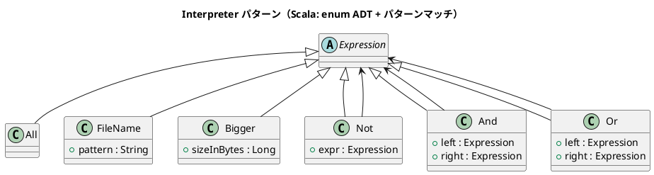

# 第 16 章: Interpreter

## はじめに

ファイル検索の条件を組み合わせて、「拡張子が `.txt` でサイズが 3000 バイトより大きいファイル」のような複雑な検索式を表現したいとします。

**Interpreter パターン**は、言語の文法を定義し、その文法に従った式を解釈（評価）するパターンです。

---

## パターンの構造



---

## TDD で作る

### Red: テストを書く

```scala
class InterpreterSuite extends munit.FunSuite:
  val files = List(
    FileEntry("report.txt", 1000),
    FileEntry("photo.jpg", 5000),
    FileEntry("data.csv", 2000),
    FileEntry("readme.md", 500),
    FileEntry("backup.txt", 8000)
  )

  test("And で条件を組み合わせる") {
    val expr = And(FileName("*.txt"), Bigger(3000))
    val result = Expression.evaluate(expr, files)
    assertEquals(result.map(_.name), List("backup.txt"))
  }

  test("複雑な式を組み合わせる") {
    val expr = Or(
      And(FileName("*.txt"), Bigger(3000)),
      FileName("*.md")
    )
    val result = Expression.evaluate(expr, files)
    assertEquals(result.map(_.name), List("readme.md", "backup.txt"))
  }
```

### Green: 実装する

```scala
enum Expression:
  case All
  case FileName(pattern: String)
  case Bigger(sizeInBytes: Long)
  case Not(expr: Expression)
  case And(left: Expression, right: Expression)
  case Or(left: Expression, right: Expression)

object Expression:
  def evaluate(expr: Expression, files: List[FileEntry]): List[FileEntry] =
    expr match
      case All => files
      case FileName(pattern) =>
        files.filter(f => f.name.matches(pattern.replace("*", ".*")))
      case Bigger(size) =>
        files.filter(_.size > size)
      case Not(e) =>
        val matched = evaluate(e, files).toSet
        files.filterNot(matched.contains)
      case And(left, right) =>
        val l = evaluate(left, files).toSet
        val r = evaluate(right, files).toSet
        files.filter(f => l.contains(f) && r.contains(f))
      case Or(left, right) =>
        val l = evaluate(left, files).toSet
        val r = evaluate(right, files).toSet
        files.filter(f => l.contains(f) || r.contains(f))

case class FileEntry(name: String, size: Long)
```

### Refactor: 振り返り

- **enum（ADT）** で式の全バリアントを型安全に定義します。`sealed` な性質により、パターンマッチの網羅性がコンパイル時にチェックされます。
- **再帰的なパターンマッチ** で式を評価します。`Not`, `And`, `Or` は内部の式を再帰的に評価します。
- `FileEntry` はテスト用のデータ構造で、ファイルシステムから独立しています。
- 新しい式（例: `Smaller`, `NameContains`）を追加する場合、enum にケースを追加し、`evaluate` のパターンマッチに分岐を追加するだけです。

---

## Ruby / Java / Python / JavaScript との比較

| 観点 | Ruby | Java | JavaScript | Scala |
|------|------|------|------------|-------|
| AST の表現 | クラス階層 | interface + 実装クラス | クラス / オブジェクト | enum（ADT） |
| 評価 | ポリモーフィズム | Visitor パターン | 再帰関数 | パターンマッチ |
| 網羅性チェック | なし | sealed + switch | なし | match の exhaustive check |
| 新しい式の追加 | クラス追加 | クラス追加 | クラス/関数追加 | enum ケース + match 分岐追加 |

**Scala の特徴**: enum（ADT）とパターンマッチの組み合わせにより、Interpreter パターンが最も自然かつ型安全に表現できます。新しい式を追加した際にパターンマッチの漏れをコンパイラが検出します。

---

## まとめ

| 観点 | 内容 |
|------|------|
| **意図** | 言語の文法を定義し、式を解釈する |
| **適用場面** | DSL、検索条件の組み合わせ、設定ファイルの解析 |
| **Scala のアプローチ** | enum（ADT）+ パターンマッチ + 再帰的評価 |
| **メリット** | 型安全、網羅性チェック、式の組み合わせが自然 |
| **注意点** | 文法が複雑になると式クラスとパターンマッチの分岐が増大する |
| **関連パターン** | Composite（再帰的な構造）、Strategy（評価戦略の差し替え） |
