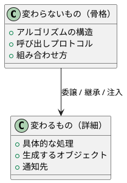
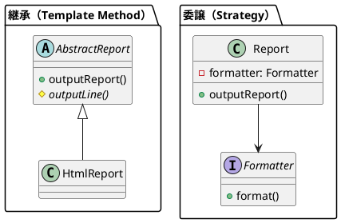

# 第 3 章 パターンで変わるものと変わらないもの

## はじめに

デザインパターンの本質は「変化する部分をカプセル化する」ことです。GoF の 23 パターンは、異なる種類の変化に対応するための設計テクニックを体系化したものです。本章では、パターンが何を一定に保ち、何を変化可能にするのかを整理します。

## 変わるものと変わらないものの分離



### パターン別の「変わるもの」

| パターン | 変わらないもの | 変わるもの |
|:---|:---|:---|
| Template Method | アルゴリズムの骨格 | 具体的なステップの実装 |
| Strategy | コンテキストの構造 | アルゴリズム全体 |
| Observer | 通知メカニズム | オブザーバーの数と種類 |
| Composite | ツリー構造の走査 | ノードの種類と振る舞い |
| Iterator | 走査プロトコル | コレクションの内部構造 |
| Command | 実行/取消のプロトコル | 具体的な操作 |
| Adapter | クライアントが期待する API | 適合先の API |
| Proxy | アクセスプロトコル | アクセス制御のルール |
| Decorator | 基本インターフェース | 追加される振る舞い |
| Singleton | インスタンスの一意性 | インスタンスの状態 |
| Factory | 生成プロトコル | 生成されるオブジェクトの種類 |
| Builder | 構築手順 | 構築されるオブジェクトの表現 |
| Interpreter | 文法構造の走査 | 具体的な文法規則 |

## TypeScript での「変わるもの」のカプセル化

### 1. interface による抽象化

```typescript
// 「変わるもの」を interface で定義する
interface Formatter {
  format(title: string, text: string[]): string;
}

// コンテキストは interface に依存する
class Report {
  constructor(private formatter: Formatter) {}
  output(title: string, text: string[]): string {
    return this.formatter.format(title, text);
  }
}
```

### 2. abstract class によるテンプレート

```typescript
abstract class Report {
  // 変わらないもの: outputReport() の構造
  outputReport(): string {
    return this.outputStart() + this.outputBody() + this.outputEnd();
  }
  // 変わるもの: 具体的なステップ
  protected abstract outputStart(): string;
  protected abstract outputBody(): string;
  protected abstract outputEnd(): string;
}
```

### 3. Generics による型安全な汎用化

```typescript
// T が「変わるもの」
function createProxy<T extends object>(target: T, handler: ProxyHandler<T>): T {
  return new Proxy(target, handler);
}
```

### 4. 関数型による Strategy 注入

```typescript
type Formatter = (title: string, text: string[]) => string;

// 関数として「変わるもの」を渡す
class Report {
  constructor(private formatter: Formatter) {}
}
```

## 継承 vs 委譲

GoF の原則:「継承よりもオブジェクトの合成を好め」



| 観点 | 継承 | 委譲 |
|:---|:---|:---|
| 柔軟性 | コンパイル時に決定 | 実行時に変更可能 |
| 結合度 | 高い | 低い |
| 適用場面 | 骨格が固定、詳細が変化 | アルゴリズム全体が差し替え |

## まとめ

デザインパターンの本質は、変化する部分を見極め、それを安全にカプセル化することです。TypeScript では、`interface`、`abstract class`、Generics、関数型を使い分けることで、「変わるもの」と「変わらないもの」の境界を型レベルで明確に定義できます。この明確さが、保守性の高い設計につながります。
