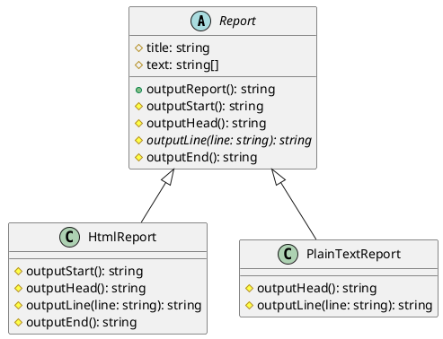

# 第 4 章 Template Method ― アルゴリズムの骨格を定義する

## はじめに

Template Method パターンは、アルゴリズムの骨格を基底クラスで定義し、具体的なステップをサブクラスに委ねるパターンです。「変わらないもの」（アルゴリズムの構造）と「変わるもの」（各ステップの実装）を分離します。

## パターンの構造



## TDD で作る

### Red: 失敗するテストを書く

```typescript
import { HtmlReport, PlainTextReport } from '../src/template-method';

describe('Template Method パターン', () => {
  it('HtmlReport は HTML 形式で出力する', () => {
    const report = new HtmlReport('Monthly Report', ['Things are going']);
    const output = report.outputReport();
    expect(output).toContain('<html>');
    expect(output).toContain('<title>Monthly Report</title>');
  });
});
```

この時点では `HtmlReport` クラスが存在しないため、コンパイルエラーになります。これが Red フェーズです。

### Green: テストを通す最小のコードを書く

```typescript
export abstract class Report {
  protected title: string;
  protected text: string[];

  constructor(title: string, text: string[]) {
    this.title = title;
    this.text = text;
  }

  outputReport(): string {
    const parts: string[] = [];
    parts.push(this.outputStart());
    parts.push(this.outputHead());
    for (const line of this.text) {
      parts.push(this.outputLine(line));
    }
    parts.push(this.outputEnd());
    return parts.join('');
  }

  protected outputStart(): string { return ''; }
  protected outputHead(): string { return this.title; }
  protected abstract outputLine(line: string): string;
  protected outputEnd(): string { return ''; }
}

export class HtmlReport extends Report {
  protected outputStart(): string { return '<html>\n'; }
  protected outputHead(): string {
    return `<head><title>${this.title}</title></head>\n<body>\n`;
  }
  protected outputLine(line: string): string { return `<p>${line}</p>\n`; }
  protected outputEnd(): string { return '</body>\n</html>\n'; }
}
```

### Refactor: 設計を改善する

- `outputReport()` がテンプレートメソッドとして骨格を定義している
- `abstract` キーワードで `outputLine()` の実装をサブクラスに強制している
- フック（`outputStart()`, `outputEnd()`）にデフォルト実装を与え、オーバーライドを任意にしている

## JavaScript との比較

| 観点 | JavaScript | TypeScript |
|:---|:---|:---|
| 抽象クラス | なし（`throw new Error()` で代用） | `abstract class` で言語サポート |
| 抽象メソッド | 慣例的 | `abstract` キーワードで強制 |
| アクセス制御 | なし | `protected` でサブクラスのみアクセス |
| 型チェック | 実行時 | コンパイル時に不足メソッドを検出 |

TypeScript では、`abstract` メソッドを実装し忘れるとコンパイルエラーになります。JavaScript ではテスト実行時まで気づけません。

## まとめ

| 項目 | 内容 |
|:---|:---|
| 意図 | アルゴリズムの骨格を定義し、ステップの実装をサブクラスに委ねる |
| 変わらないもの | `outputReport()` の呼び出し順序 |
| 変わるもの | 各ステップ（`outputLine()` 等）の具体的な実装 |
| TypeScript の利点 | `abstract class` と `protected` で安全に実装を強制 |
| 注意点 | サブクラスの増加に注意。Strategy パターンとのトレードオフを検討 |
