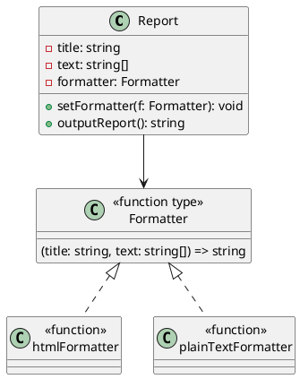

# 第 5 章 Strategy ― アルゴリズムを差し替える

## はじめに

Strategy パターンは、アルゴリズムをオブジェクト（TypeScript では関数型）として切り出し、実行時に差し替え可能にするパターンです。Template Method が継承でアルゴリズムの一部を変えるのに対し、Strategy は委譲でアルゴリズム全体を差し替えます。

## パターンの構造



## TDD で作る

### Red: 実行時に Strategy を切り替えるテスト

```typescript
it('実行時にフォーマッターを切り替えられる', () => {
  const report = new Report(title, text, htmlFormatter);
  expect(report.outputReport()).toContain('<html>');

  report.setFormatter(plainTextFormatter);
  expect(report.outputReport()).toContain('*****');
});
```

### Green: 最小限の実装

```typescript
export type Formatter = (title: string, text: string[]) => string;

export class Report {
  private formatter: Formatter;
  constructor(title: string, text: string[], formatter: Formatter) {
    this.formatter = formatter;
  }
  setFormatter(formatter: Formatter): void {
    this.formatter = formatter;
  }
  outputReport(): string {
    return this.formatter(this.title, this.text);
  }
}
```

### Refactor

- `type Formatter` として関数型を定義。TypeScript ではクラスベースの Strategy より関数型の方が簡潔
- `setFormatter()` で実行時差し替えを実現
- カスタムフォーマッター（CSV など）の注入もテストで確認

## JavaScript との比較

| 観点 | JavaScript | TypeScript |
|:---|:---|:---|
| Strategy の型定義 | なし（ダックタイピング） | `type Formatter` で関数シグネチャを強制 |
| 型チェック | 実行時エラー | コンパイル時に引数・戻り値の不一致を検出 |
| IDE サポート | 限定的 | Strategy の型に基づく補完が効く |

## まとめ

| 項目 | 内容 |
|:---|:---|
| 意図 | アルゴリズムを実行時に差し替え可能にする |
| 変わらないもの | Report のコンテキスト構造 |
| 変わるもの | フォーマットアルゴリズム全体 |
| TypeScript の利点 | 関数型 `type` でシグネチャを強制、安全な差し替え |
| Template Method との違い | 継承ではなく委譲。実行時に差し替え可能 |
