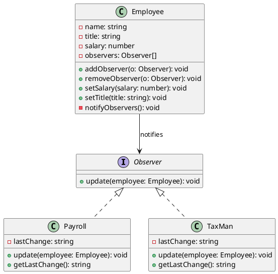

# 第 6 章 Observer ― 状態変化を通知する

## はじめに

Observer パターンは、オブジェクトの状態が変化したとき、それに依存する複数のオブジェクトに自動的に通知を送るパターンです。イベント駆動プログラミングの基盤となるパターンであり、疎結合な設計を実現します。

## パターンの構造



## TDD で作る

### Red: Observer への通知テスト

```typescript
it('給与変更時に Payroll に通知される', () => {
  const employee = new Employee('Alice', 'Engineer', 50000);
  const payroll = new Payroll();
  employee.addObserver(payroll);
  employee.setSalary(60000);
  expect(payroll.getLastChange()).toContain('60000');
});
```

### Green: 最小限の実装

```typescript
interface Observer {
  update(employee: Employee): void;
}

class Employee {
  private observers: Observer[] = [];

  constructor(
    private name: string,
    private title: string,
    private salary: number
  ) {}

  addObserver(observer: Observer): void {
    this.observers.push(observer);
  }

  setSalary(salary: number): void {
    this.salary = salary;
    this.notifyObservers();
  }

  private notifyObservers(): void {
    this.observers.forEach(observer => observer.update(this));
  }

  getSalary(): number {
    return this.salary;
  }
}

class Payroll implements Observer {
  private lastChange = '';

  update(employee: Employee): void {
    this.lastChange = `給与変更: ${employee.getSalary()}`;
  }

  getLastChange(): string {
    return this.lastChange;
  }
}
```

まずは給与変更通知だけに絞り、`Observer` 契約と通知経路を通します。

### setTitle() による通知

`Employee` は給与だけでなく、タイトル（役職）変更時にも `notifyObservers()` を呼び出します。

```typescript
setTitle(title: string): void {
  this.title = title;
  this.notifyObservers();
}
```

```typescript
it('タイトル変更時に TaxMan に通知される', () => {
  const employee = new Employee('Bob', 'Engineer', 50000);
  const taxMan = new TaxMan();
  employee.addObserver(taxMan);

  employee.setTitle('Senior Engineer');

  expect(taxMan.getLastChange()).toContain('TaxMan');
  expect(taxMan.getLastChange()).toContain('Bob');
});
```

### getter メソッド

`Employee` は `getName()`、`getTitle()`、`getSalary()` の 3 つの getter を持ちます。Observer の `update()` メソッド内でこれらを使い、通知メッセージを組み立てます。

```typescript
it('従業員の名前・タイトル・給与を取得できる', () => {
  const employee = new Employee('Eve', 'CTO', 150000);
  expect(employee.getName()).toBe('Eve');
  expect(employee.getTitle()).toBe('CTO');
  expect(employee.getSalary()).toBe(150000);
});
```

### オブザーバーの削除

`removeObserver()` で登録を解除すると、以降の状態変化は通知されません。

```typescript
it('オブザーバーを削除すると通知されなくなる', () => {
  const employee = new Employee('Dave', 'Director', 90000);
  const payroll = new Payroll();
  employee.addObserver(payroll);

  employee.setSalary(95000);
  expect(payroll.getLastChange()).toContain('95000');

  employee.removeObserver(payroll);
  employee.setSalary(100000);

  // payroll は古い変更のまま
  expect(payroll.getLastChange()).toContain('95000');
});
```

`removeObserver()` は `filter()` と参照一致で対象を除外します。削除後も `Payroll` オブジェクト自体は破棄されず、最後に受け取った通知の状態を保持し続けます。

### Refactor

- `interface Observer` で通知プロトコルを型安全に定義
- `removeObserver()` で配列の `filter()` を使い、参照一致で削除
- `notifyObservers()` を `private` にして内部実装を隠蔽

## JavaScript との比較

| 観点 | JavaScript | TypeScript |
|:---|:---|:---|
| Observer の定義 | 暗黙的（`update` メソッドを期待） | `interface Observer` で契約を明示 |
| 型安全性 | なし | `update(employee: Employee)` で引数型を強制 |
| イベントシステム | `EventEmitter` (Node.js) | `interface` ベースで独自実装 |

## まとめ

| 項目 | 内容 |
|:---|:---|
| 意図 | オブジェクト間の一対多の依存関係を定義し、状態変化を自動通知する |
| 変わらないもの | 通知メカニズム（`addObserver` / `notifyObservers`） |
| 変わるもの | オブザーバーの数と種類 |
| TypeScript の利点 | `interface Observer` で通知プロトコルを型安全に定義 |
| 注意点 | メモリリーク（Observer の解除忘れ）に注意 |
