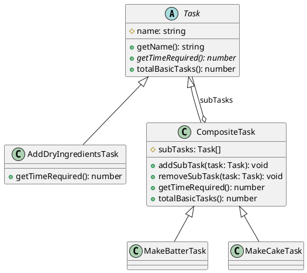

# 第 7 章 Composite ― 部分と全体を同一視する

## はじめに

Composite パターンは、個々のオブジェクト（リーフ）と複合オブジェクト（コンポジット）を同一のインターフェースで扱うパターンです。ツリー構造のデータを再帰的に処理する場面で力を発揮します。

## パターンの構造



## TDD で作る

### Red: 再帰的な時間計算テスト

```typescript
it('MakeCakeTask は全ての子タスクを含む合計時間を返す', () => {
  const cake = new MakeCakeTask();
  expect(cake.getTimeRequired()).toBe(45.0);
});
```

### Green: 最小限の実装

`CompositeTask.getTimeRequired()` で `reduce` を使い、子タスクの合計を再帰的に計算します。

### Refactor

- `abstract class Task` で共通インターフェースを強制
- `ReadonlyArray<Task>` で外部からの直接変更を防止
- `totalBasicTasks()` をリーフでは `1`、コンポジットでは再帰的合計として実装

## JavaScript との比較

| 観点 | JavaScript | TypeScript |
|:---|:---|:---|
| 抽象基底クラス | なし | `abstract class Task` |
| 型安全な子要素 | `any[]` | `Task[]` で型制約 |
| ReadonlyArray | なし | `ReadonlyArray<Task>` で不変性を保証 |

## まとめ

| 項目 | 内容 |
|:---|:---|
| 意図 | 個々のオブジェクトと複合オブジェクトを同一インターフェースで扱う |
| 変わらないもの | ツリー構造の走査ロジック |
| 変わるもの | ノードの種類と振る舞い |
| TypeScript の利点 | `abstract class` で統一インターフェースを強制、`ReadonlyArray` で不変性保証 |
| 注意点 | ツリーの深さが深すぎるとスタックオーバーフローの危険 |
