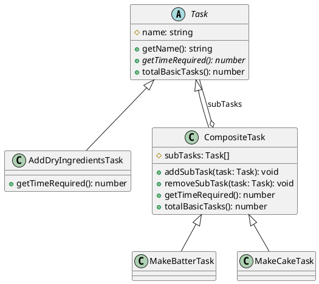

# 第 7 章 Composite ― 部分と全体を同一視する

## はじめに

Composite パターンは、個々のオブジェクト（リーフ）と複合オブジェクト（コンポジット）を同一のインターフェースで扱うパターンです。ツリー構造のデータを再帰的に処理する場面で力を発揮します。

## パターンの構造



## TDD で作る

### Red: 再帰的な時間計算テスト

```typescript
it('MakeCakeTask は全ての子タスクを含む合計時間を返す', () => {
  const cake = new MakeCakeTask();
  expect(cake.getTimeRequired()).toBe(45.0);
});
```

### Green: 最小限の実装

```typescript
abstract class Task {
  constructor(protected readonly name: string) {}

  getName(): string {
    return this.name;
  }

  abstract getTimeRequired(): number;

  totalBasicTasks(): number {
    return 1;
  }
}

class CompositeTask extends Task {
  protected readonly subTasks: Task[] = [];

  addSubTask(task: Task): void {
    this.subTasks.push(task);
  }

  getTimeRequired(): number {
    return this.subTasks.reduce((total, task) => total + task.getTimeRequired(), 0);
  }

  override totalBasicTasks(): number {
    return this.subTasks.reduce((total, task) => total + task.totalBasicTasks(), 0);
  }
}
```

合計時間と基本タスク数の両方を再帰で通しておくと、Composite の利点が見えやすくなります。

### リーフタスク一覧

実装では以下のリーフタスクが定義されており、それぞれ固定の所要時間を返します。

| クラス名 | タスク名 | getTimeRequired() |
|:---|:---|---:|
| `AddDryIngredientsTask` | Add Dry Ingredients | 1.0 |
| `AddLiquidsTask` | Add Liquids | 0.5 |
| `MixTask` | Mix | 3.0 |
| `FillPanTask` | Fill Pan | 0.5 |
| `BakeTask` | Bake | 25.0 |
| `FrostTask` | Frost | 10.0 |
| `PackageTask` | Package | 5.0 |

`MakeBatterTask` は `AddDryIngredientsTask` + `AddLiquidsTask` + `MixTask` を子タスクとして持ち、合計 4.5 を返します。`MakeCakeTask` は `MakeBatterTask` を含む全 7 タスクの合計 45.0 を返します。

### getSubTasks() と removeSubTask()

`CompositeTask` は子タスクの参照取得と削除もサポートしています。

```typescript
getSubTasks(): ReadonlyArray<Task> {
  return this.subTasks;
}

removeSubTask(task: Task): void {
  this.subTasks = this.subTasks.filter((t) => t !== task);
}
```

`getSubTasks()` は `ReadonlyArray<Task>` を返すため、外部から直接 `push` や `splice` で子タスク配列を変更することはできません。`removeSubTask()` は参照一致（`!==`）で対象を除外した新しい配列を作成します。

```typescript
it('CompositeTask にサブタスクを追加・削除できる', () => {
  const composite = new CompositeTask('Test');
  const pkg = new PackageTask();
  composite.addSubTask(pkg);
  expect(composite.getTimeRequired()).toBe(5.0);

  composite.removeSubTask(pkg);
  expect(composite.getTimeRequired()).toBe(0);
});
```

### Refactor

- `abstract class Task` で共通インターフェースを強制
- `ReadonlyArray<Task>` で外部からの直接変更を防止
- `totalBasicTasks()` をリーフでは `1`、コンポジットでは再帰的合計として実装

## JavaScript との比較

| 観点 | JavaScript | TypeScript |
|:---|:---|:---|
| 抽象基底クラス | なし | `abstract class Task` |
| 型安全な子要素 | `any[]` | `Task[]` で型制約 |
| ReadonlyArray | なし | `ReadonlyArray<Task>` で不変性を保証 |

## まとめ

| 項目 | 内容 |
|:---|:---|
| 意図 | 個々のオブジェクトと複合オブジェクトを同一インターフェースで扱う |
| 変わらないもの | ツリー構造の走査ロジック |
| 変わるもの | ノードの種類と振る舞い |
| TypeScript の利点 | `abstract class` で統一インターフェースを強制、`ReadonlyArray` で不変性保証 |
| 注意点 | ツリーの深さが深すぎるとスタックオーバーフローの危険 |
