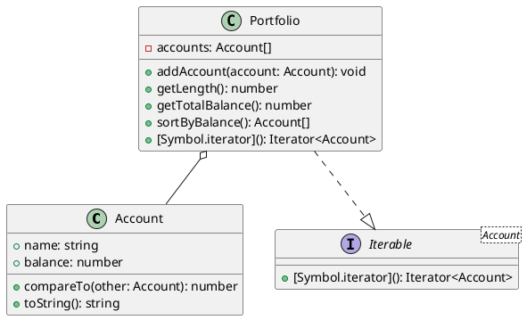

# 第 8 章 Iterator ― 要素を順番に取り出す

## はじめに

Iterator パターンは、コレクションの内部構造を公開せずに、要素を順番に取り出す方法を提供するパターンです。TypeScript では `Iterable` プロトコルと `Symbol.iterator` を使って、言語レベルでイテレーションをサポートします。

## パターンの構造



## TDD で作る

### Red: for...of でイテレートするテスト

```typescript
it('Portfolio は for...of でイテレートできる', () => {
  const portfolio = new Portfolio();
  portfolio.addAccount(new Account('Alice', 1000));
  portfolio.addAccount(new Account('Bob', 2000));
  const names: string[] = [];
  for (const account of portfolio) {
    names.push(account.name);
  }
  expect(names).toEqual(['Alice', 'Bob']);
});
```

### Green: Symbol.iterator の実装

```typescript
[Symbol.iterator](): Iterator<Account> {
  let index = 0;
  const accounts = this.accounts;
  return {
    next(): IteratorResult<Account> {
      if (index < accounts.length) {
        return { value: accounts[index++], done: false };
      }
      return { value: undefined as unknown as Account, done: true };
    },
  };
}
```

### Refactor

- `Iterable<Account>` インターフェースを実装し、`for...of` とスプレッド構文の両方をサポート
- `compareTo` で Comparable パターンも実装し、ソートを可能に

## JavaScript との比較

| 観点 | JavaScript | TypeScript |
|:---|:---|:---|
| Iterable プロトコル | `Symbol.iterator` | `implements Iterable<T>` で型安全に |
| Iterator の戻り値型 | 任意 | `IteratorResult<T>` で型付き |
| ジェネリクス | なし | `Iterable<Account>` で要素型を固定 |

## まとめ

| 項目 | 内容 |
|:---|:---|
| 意図 | コレクションの内部構造を隠蔽し、統一的な走査手段を提供する |
| 変わらないもの | 走査プロトコル（`Symbol.iterator`） |
| 変わるもの | コレクションの内部構造 |
| TypeScript の利点 | `Iterable<T>` で型安全なイテレーション、`for...of` やスプレッド構文と統合 |
| 注意点 | 無限イテレータを作る場合は `done: true` の条件に注意 |
