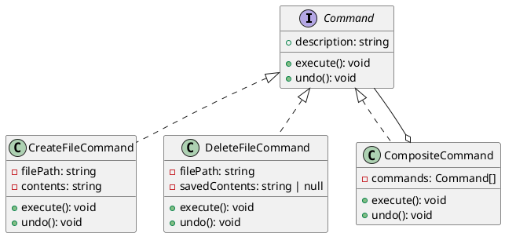

# 第 9 章 Command ― 操作をオブジェクト化する

## はじめに

Command パターンは、操作をオブジェクトとしてカプセル化するパターンです。操作の実行、取り消し（undo）、記録、キューイングなどが可能になります。

## パターンの構造



## TDD で作る

### Red: Undo テスト

```typescript
it('DeleteFileCommand の undo はファイルを復元する', () => {
  const filePath = path.join(tmpDir, 'test.txt');
  fs.writeFileSync(filePath, 'content');
  const cmd = new DeleteFileCommand(filePath);
  cmd.execute();
  cmd.undo();
  expect(fs.existsSync(filePath)).toBe(true);
  expect(fs.readFileSync(filePath, 'utf-8')).toBe('content');
});
```

### Green: 最小限の実装

`DeleteFileCommand` は `execute()` 時にファイル内容を `savedContents` に保存し、`undo()` で復元します。

### Refactor

- `interface Command` で execute/undo/description のプロトコルを定義
- `CompositeCommand` は Composite パターンとの組み合わせ。`undo()` は逆順に実行
- `readonly description` でコマンドの説明を不変プロパティとして保持

## JavaScript との比較

| 観点 | JavaScript | TypeScript |
|:---|:---|:---|
| Command インターフェース | 暗黙的 | `interface Command` で明示 |
| readonly プロパティ | なし | `readonly description` で不変性保証 |
| 型安全な Composite | `any[]` | `Command[]` で型制約 |

## まとめ

| 項目 | 内容 |
|:---|:---|
| 意図 | 操作をオブジェクトとしてカプセル化し、実行・取消を可能にする |
| 変わらないもの | 実行/取消のプロトコル |
| 変わるもの | 具体的な操作の内容 |
| TypeScript の利点 | `interface` で execute/undo を型安全に強制、`readonly` で不変性保証 |
| 注意点 | undo のための状態保存にメモリコストがかかる |
