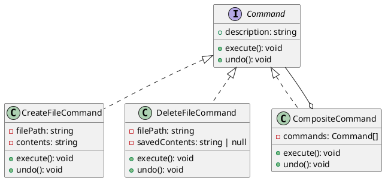

# 第 9 章 Command ― 操作をオブジェクト化する

## はじめに

Command パターンは、操作をオブジェクトとしてカプセル化するパターンです。操作の実行、取り消し（undo）、記録、キューイングなどが可能になります。

## パターンの構造



## TDD で作る

### Red: Undo テスト

```typescript
it('DeleteFileCommand の undo はファイルを復元する', () => {
  const filePath = path.join(tmpDir, 'test.txt');
  fs.writeFileSync(filePath, 'content');
  const cmd = new DeleteFileCommand(filePath);
  cmd.execute();
  cmd.undo();
  expect(fs.existsSync(filePath)).toBe(true);
  expect(fs.readFileSync(filePath, 'utf-8')).toBe('content');
});
```

### Green: 最小限の実装

```typescript
class DeleteFileCommand implements Command {
  readonly description: string;
  private savedContents: string | null = null;

  constructor(private readonly filePath: string) {
    this.description = `Delete ${filePath}`;
  }

  execute(): void {
    this.savedContents = fs.readFileSync(this.filePath, 'utf-8');
    fs.unlinkSync(this.filePath);
  }

  undo(): void {
    if (this.savedContents !== null) {
      fs.writeFileSync(this.filePath, this.savedContents);
    }
  }
}

class CompositeCommand implements Command {
  readonly description = 'Composite command';

  constructor(private readonly commands: Command[]) {}

  execute(): void {
    this.commands.forEach(command => command.execute());
  }

  undo(): void {
    [...this.commands].reverse().forEach(command => command.undo());
  }
}
```

まずは `undo` に必要な状態保存と、複合コマンドの順方向 / 逆方向実行を実装します。

### existsSync ガード

実際の実装では、`DeleteFileCommand.execute()` はファイルが存在しない場合に何もしない防御的なガードを入れています。

```typescript
execute(): void {
  if (fs.existsSync(this.filePath)) {
    this.savedContents = fs.readFileSync(this.filePath, 'utf-8');
    fs.unlinkSync(this.filePath);
  }
}
```

`existsSync()` でファイルの存在を確認してから内容を保存・削除するため、存在しないファイルへの `DeleteFileCommand` を実行してもエラーは発生しません。同様に `CreateFileCommand.undo()` でも `existsSync()` を使い、既に削除済みのファイルに対する二重削除を防止しています。

### savedContents のリセット

`DeleteFileCommand.undo()` はファイルを復元した後、`savedContents` を `null` にリセットします。

```typescript
undo(): void {
  if (this.savedContents !== null) {
    fs.writeFileSync(this.filePath, this.savedContents, 'utf-8');
    this.savedContents = null;
  }
}
```

`null` チェックにより、`execute()` が実行されていない状態（ファイルが存在しなかった場合を含む）で `undo()` を呼んでも安全です。また、リセットにより同じコマンドオブジェクトで `undo()` を二度呼んでも、二回目は何も起きません。

### Refactor

- `interface Command` で execute/undo/description のプロトコルを定義
- `CompositeCommand` は Composite パターンとの組み合わせ。`undo()` は逆順に実行
- `readonly description` でコマンドの説明を不変プロパティとして保持

## JavaScript との比較

| 観点 | JavaScript | TypeScript |
|:---|:---|:---|
| Command インターフェース | 暗黙的 | `interface Command` で明示 |
| readonly プロパティ | なし | `readonly description` で不変性保証 |
| 型安全な Composite | `any[]` | `Command[]` で型制約 |

## まとめ

| 項目 | 内容 |
|:---|:---|
| 意図 | 操作をオブジェクトとしてカプセル化し、実行・取消を可能にする |
| 変わらないもの | 実行/取消のプロトコル |
| 変わるもの | 具体的な操作の内容 |
| TypeScript の利点 | `interface` で execute/undo を型安全に強制、`readonly` で不変性保証 |
| 注意点 | undo のための状態保存にメモリコストがかかる |
