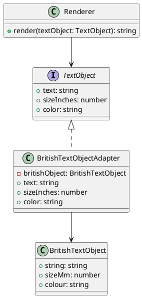

# 第 10 章 Adapter ― インターフェースを変換する

## はじめに

Adapter パターンは、互換性のないインターフェースを変換し、既存のクラスを新しいインターフェースで利用可能にするパターンです。レガシーコードや外部ライブラリとの統合に有用です。

## パターンの構造



## TDD で作る

### Red: 単位変換テスト

```typescript
it('BritishTextObjectAdapter は mm を inches に変換する', () => {
  const british = new BritishTextObject('Hello', 25.4, 'red');
  const adapter = new BritishTextObjectAdapter(british);
  expect(adapter.sizeInches).toBeCloseTo(1.0, 5);
});
```

### Green: getter による変換

```typescript
export class BritishTextObjectAdapter implements TextObject {
  private britishObject: BritishTextObject;
  constructor(britishObject: BritishTextObject) {
    this.britishObject = britishObject;
  }
  get text(): string { return this.britishObject.string; }
  get sizeInches(): number { return this.britishObject.sizeMm / 25.4; }
  get color(): string { return this.britishObject.colour; }
}
```

### Refactor

- `implements TextObject` で Adapter がターゲットインターフェースに適合することをコンパイル時に保証
- getter を使って、呼び出し側からはプロパティアクセスに見える
- `Renderer` は `TextObject` にのみ依存し、`BritishTextObject` を知らない

## JavaScript との比較

| 観点 | JavaScript | TypeScript |
|:---|:---|:---|
| ターゲットインターフェース | 暗黙的 | `interface TextObject` で明示 |
| 型適合チェック | なし | `implements` でコンパイル時チェック |
| getter | ES5+ でサポート | 型付き getter |

## まとめ

| 項目 | 内容 |
|:---|:---|
| 意図 | 互換性のないインターフェースを変換する |
| 変わらないもの | クライアントが期待する API（`TextObject`） |
| 変わるもの | 適合先のクラスの API |
| TypeScript の利点 | `interface` と `implements` でアダプタの型適合をコンパイル時に保証 |
| 注意点 | Adapter が多すぎるとコードが複雑になる。根本的な設計の見直しも検討 |
