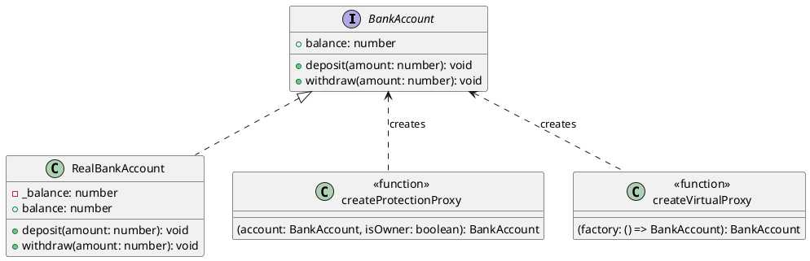

# 第 11 章 Proxy ― アクセスを制御する

## はじめに

Proxy パターンは、対象オブジェクトへのアクセスを制御する代理オブジェクトを提供するパターンです。TypeScript の `Proxy<T>` を活用することで、型安全かつ柔軟にアクセス制御を実現できます。

## パターンの構造



## TDD で作る

### Red: Protection Proxy テスト

```typescript
it('オーナーでなければ出金はエラーになる', () => {
  const real = new RealBankAccount(100);
  const proxy = createProtectionProxy(real, false);
  expect(() => proxy.withdraw(50)).toThrow('Access denied');
});
```

### Green: JavaScript Proxy を使った実装

```typescript
export function createProtectionProxy(
  account: BankAccount, isOwner: boolean
): BankAccount {
  return new Proxy(account, {
    get(target, prop, receiver) {
      if (prop === 'withdraw' && !isOwner) {
        return () => { throw new Error('Access denied: only the owner can withdraw'); };
      }
      return Reflect.get(target, prop, receiver);
    },
  });
}
```

### Refactor

- `createVirtualProxy` で遅延初期化（Virtual Proxy）も実装
- JavaScript の `Proxy` と `Reflect` を活用し、TypeScript の型システムと統合
- ファクトリ関数パターンで Proxy 生成を隠蔽

## JavaScript との比較

| 観点 | JavaScript | TypeScript |
|:---|:---|:---|
| Proxy オブジェクト | `new Proxy()` | `new Proxy()` + 型パラメータ |
| 戻り値の型 | `any` | `BankAccount` インターフェース |
| アクセス制御の型安全性 | なし | Proxy の戻り値が元のインターフェースに準拠 |

## まとめ

| 項目 | 内容 |
|:---|:---|
| 意図 | 対象オブジェクトへのアクセスを制御する代理を提供する |
| 変わらないもの | アクセスプロトコル（`BankAccount` インターフェース） |
| 変わるもの | アクセス制御のルール（権限チェック、遅延初期化） |
| TypeScript の利点 | `Proxy<T>` で型安全な代理を構築。インターフェースの準拠をコンパイル時に保証 |
| 注意点 | `Proxy` は性能オーバーヘッドがある。必要な場面でのみ使用 |
