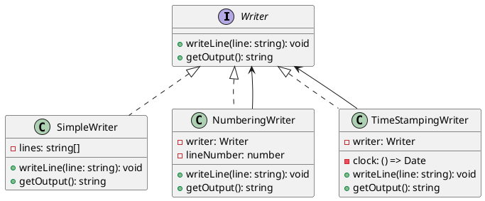

# 第 12 章 Decorator ― 動的に機能を追加する

## はじめに

Decorator パターンは、既存のオブジェクトに動的に振る舞いを追加するパターンです。継承ではなく委譲を使い、機能を柔軟に組み合わせることができます。

## パターンの構造



## TDD で作る

### Red: デコレータの重ね掛けテスト

```typescript
it('Decorator を重ねて適用できる', () => {
  const fixedDate = new Date('2024-01-01T00:00:00.000Z');
  const writer = new TimeStampingWriter(
    new NumberingWriter(new SimpleWriter()),
    () => fixedDate
  );
  writer.writeLine('hello');
  expect(writer.getOutput()).toBe('1: [2024-01-01T00:00:00.000Z] hello');
});
```

### Green: 委譲による実装

各 Decorator は `Writer` を受け取り、`writeLine()` で加工してから内部の `Writer` に委譲します。

### Refactor

- `TimeStampingWriter` はテスト用に `clock` 関数を注入可能にする（テスト容易性）
- 全ての Decorator が同じ `Writer` インターフェースを実装するため、任意の順序で重ね掛け可能
- 重ね掛けの順序で出力が変わることをテストで確認

## JavaScript との比較

| 観点 | JavaScript | TypeScript |
|:---|:---|:---|
| Writer インターフェース | 暗黙的 | `interface Writer` で契約を明示 |
| 型安全な重ね掛け | なし | 全 Decorator が `Writer` を実装するため型安全 |
| テスト用 clock 注入 | 可能だが型なし | `clock: () => Date` で型付きの依存注入 |

## まとめ

| 項目 | 内容 |
|:---|:---|
| 意図 | 既存オブジェクトに動的に振る舞いを追加する |
| 変わらないもの | 基本インターフェース（`Writer`） |
| 変わるもの | 追加される振る舞い（行番号、タイムスタンプ等） |
| TypeScript の利点 | `interface` で Decorator の型適合を保証。依存注入の型安全性 |
| 注意点 | Decorator が多すぎるとデバッグが困難になる |
